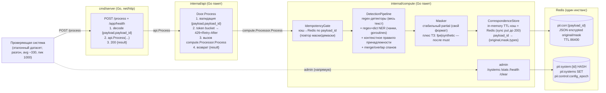

# HACK — Модуль безопасности персональных данных (PII-guard) за день

**Основной план.** Подробное описание всех фич из [`plan.md`](plan.md):
архитектура, алгоритмы, промпты треков, критерии приёмки. `plan.md` — краткая
карта; этот файл — развёрнутый playbook для исполнения.

План вайбкодинга сервиса идентификации/маскирования/демаскирования ПД в
запросах к LLM. Контракт проверки — `POST /process` (Приложение A ТЗ):
синхронный `{payload, payload_id} → {result}`, направление (маска/демаска)
определяется по `payload_id`.

**Стек (зафиксировано):** весь runtime на **Go**. Rust `compute/` снят и
переписан. Один Go-модуль, два пакета: `internal/api` (дверь) + `internal/compute`
(движок), вызовы функций без HTTP. SSE-шлюз (`gateway`) **не нужен** — контракт
синхронный, чекер бьёт один `POST /process`.

**Разделение на 2 пакета (один Go-модуль, без HTTP между ними):**

| Пакет | Роль |
|---|---|
| `internal/api` | Тонкая дверь: валидация, rate limiter, вызов compute как функции |
| `internal/compute` | Вся логика: детекция, маскирование, хранилище, admin, stats |

Взаимодействие api ↔ compute — **на уровне пакетов** (прямой вызов функций),
а не HTTP. HTTP-слой один — `cmd/server` (net/http), который принимает
`POST /process` и вызывает `api.Process`.

**Принятые решения (зафиксированы, с правками от вводных жюри 2026-09-22):**

| Решение | Выбор |
|---|---|
| Отношение к старому плану | Этот файл — источник истины. Паттерн split api/compute и Redis оставлен; очередь/Centrifugo/EDF не нужны |
| Split | Один Go-модуль, два пакета `internal/api` + `internal/compute`. Вызовы функций, не HTTP. Redis — источник соответствий |
| Движок детекции | Гибрид: regex+словари+checksum (структурные ПД) + regex+dict NER (ФИО, адреса, органы). Качество = recall/precision, не «похожесть маски на выдуманный эталон» |
| Маскирование | Стабильная частичная маска своего формата. Жюри всегда гоняет **нашу** маску, не чужой эталон. Смысл текста для LLM сохраняем |
| Обратимость | Store `payload_id → {original, mask}`: in-memory + Redis. `put` **синхронный до 200**. Демаска — lookup, без пайплайна |
| Путь обработки | Синхронный вызов api→compute. Без очереди |
| system_id | В контракте `/process` нет → default-policy. Admin `/systems` — плюс для жюри, не на критическом пути чекера |
| Наблюдаемость | Логи без значений ПД. Считаем mean / p50 / p95 / p99, `mask_ok` и `demask_ok` (должны совпасть), 429 отдельно |
| 429 | Не ошибка у жюри, но **пишется в статистику**. Не 429-ить демаску и ретраи. Headroom лимитера выше пика 1000 |
| Качество кода | ~6к правил (complexity, DRY, KISS, deprecated, грязный код) — gate zip. `gofmt`/`go vet`/короткие функции — must, не послесловие |

---

## 0A. Вводные организаторов (заморожены, 2026-09-22)

Ответы жюри — это требования скоринга. Они **важнее** догадок из кейса балансировщика и важнее выдуманного «эталона маски».

| # | Ответ жюри | Как читаем | Что делаем в коде |
|---|---|---|---|
| 1 | «Слабее» | Нагрузка слабее, чем в балансировщике / чем пугает цифра RPS 1000 в ТЗ | Не оптимизируем под постоянные 2000 RPS. Не тащим очереди, EDF, деление лимитов по подам. Пик 1000 обязан проходить с запасом CPU; средний режим ~330 RPS должен быть «скучным» (почти нулевые 429, p99 с запасом до 1с) |
| 2 | Автопроверка при zip / ручном запуске. Доступа к системе нет. Оценят последнюю версию сервиса | Чекер закрытый. Итерироваться по его логам нельзя. Поднимать «ещё разок» перед жюри нельзя | Selfcheck + load с разгоном — единственная обратная связь. Сервис держим живым. Zip пакуем скриптом (только исходники). Health готов **до** первого запроса |
| 3 | Нагрузка с **разгоном**, средний RPS **~330**, пики **до 1000**. 429 **не ошибка**, но **в статистике** | Чекер не бьёт 1000 с первой секунды. Холодный старт успеет прогреться. 429 не валит прогон, но портит картину | Token bucket с запасом (цель ≥1200–1500, не ровно 1000). Разгон симулируем в `demo/load.py`. 429 только при реальной перегрузке CPU, не «чтобы красиво отсечь». Считаем 429, но цель на пике 1000 — стремиться к нулю |
| 4 | Смотрят **все** метрики: средний, 99, 95, 50. **Число демасок = число масок** | Недостаточно удержать p95. Провальный p99 или высокий mean бьёт оценку. Сломанная демаска (429/500/промах store) ломает инвариант пары | `/stats` и selfcheck считают mean+p50+p95+p99. Демаска: fast-path, **без** семафора детекции, **без** 429. `put` в Redis завершён до ответа 200 на маску. TTL store ≥ длительности прогона (сутки, не час «на всякий») |
| 5 | «Всегда ваша маска» | На обратном шаге жюри шлёт **наш** `result`, не эталонную маску и не искажённый текст. Формат маски — наш | Lookup по точному совпадению `payload == stored.mask`. Не подгоняем Левенштейн к выдуманным `И. И. И.` / `45** ****56` как к gate. Маска должна: (а) закрыть ПД, (б) оставить смысл, (в) быть стабильной при ретрае |
| 6 | ~6к правил качества: complexity, DRY, KISS, deprecated, грязный код | Zip-проверка — **gate**: без неё решение не учитывается. Один язык = одна поверхность | Коротко: маленькие функции, один детектор — один тип, без deprecated API, без мёртвого кода и `todo!()` в релизе, `gofmt` + `go vet`. FPE/synthetic/четыре режима маски — после must-have |

### Инварианты скоринга (нарушил — проиграл пару/метрику)

1. **Pair invariant.** Каждый успешный mask по `payload_id` обязан иметь успешный demask с `result == original`. Счётчики равны.
2. **Your-mask invariant.** Demask получает ровно нашу строку. Store + exact match — правильная модель, не «вычислить обратную маску».
3. **No-PII-in-telemetry.** В логах и `/stats` нет значений ПД, только типы, длины, payload_id, тайминги.
4. **Zip gate.** Один `.zip` исходников, без `target/`, `node_modules`, датасетов, бинарников.
5. **Latency set.** Жюри смотрит mean, p50, p95, p99, не одну цифру.

---

## 0B. Оценка исходного плана (что оставить / что поменять)

План как playbook сильный: контракт `POST /process`, идемпотентность по `payload_id`, regex+checksum, контекст «Пушкин ≠ ПД», тонкий api, compute, без очереди. Это оставляем.

Главная правка: **compute переезжает с Rust на Go** и становится пакетом того же модуля. HTTP-форвард api→compute заменяется прямым вызовом функции. Это убирает hop, сетевые таймауты (502/504) и второй язык из zip.

| Тема | В исходном плане | Почему это проблема | Правка |
|---|---|---|---|
| Главная метрика маски | Span-based Левенштейн до выдуманного эталона ≤0.15 | Жюри: «всегда ваша маска». Эталонный формат не контракт | Gate: roundtrip 100% + покрытие типов ТЗ + мало FP. Формат маски — стабильный свой. Selfcheck эталона оставить как **регрессию стиля**, не как критерий сдачи |
| Нагрузка | RPS 1000 постоянно, бонус 2000, 429≈0 при ≤capacity | Среднее ~330, пик 1000, разгон, нагрузка слабее | Целевой режим: avg 330 без 429, пик 1000 без деградации p99. 2000 — опциональный плюс ТЗ, не трек дня |
| 429 | «контракт разрешает, режем в 1000» | 429 идёт в статистику. На пике 1000 лимитер=1000 начнёт 429-ить | Capacity с запасом. Демаска и cache-hit **не** проходят через семафор детекции |
| Redis `put` | Background, не блокирует 200 | Гонка: чекер сразу шлёт нашу маску обратно → miss → пара mask/demask разъедется | `put` write-through **до** 200. Фон — только реплика/метрики, не соответствие |
| TTL 3600 | Час | Длинный прогон / повтор демаски после паузы | Default TTL 86400. Ключ маленький относительно риска промаха |
| 4 режима маски + FPE | partial/fpe/synthetic/redact | ~6к правил + KISS. На чекере один режим | Must: один `partial`. FPE/synthetic — плюс ТЗ, отдельным треком после зелёного roundtrip |
| Admin `/systems` | На критическом пути архитектуры | В `/process` нет `system_id`. Чекер ходит в default | Default-policy в коде. Admin — демо гибкости (ТЗ «управлять правилами»), не блокер `/process` |
| СНИЛС | В 12 структурных детекторах | В ТЗ нет СНИЛС | Оставить (дешёвый checksum, не вредит), не тратить на него день |
| Даты | Любая дата → ПД | ТЗ: дата **рождения** и дата **выдачи паспорта**. Маскировать «12.01.2024» в обычном тексте — ложное срабатывание | DateDetector только с маркером (`родил`, `дата рождения`, `выдан`, `дата выдачи`) или рядом с паспортом/в/у |
| Адрес | Один спан на всю строку | ТЗ просит компоненты: страна, индекс, город, улица, дом, квартира | Детект компонентов + merge в адресный спан; индекс уже структурный |
| Шифрование | Ключ FPE в env, Redis plaintext | ТЗ: шифрование, ПД не в метриках. В Redis лежит original | AES-GCM original+mask в Redis ключом из env. Логи и так без значений |
| Инструкция настройки | Нет | ТЗ: ≤5 предложений | `README.md` на 5 предложений: env, compose, `/process`, `/systems`, что не логируем |
| Качество кода | «без комментариев» | 6к правил. `todo!()` и 200-строчные хендлеры не пройдут. Deprecated: смотреть версии axum/redis/tower | Трек 8: `go vet`, `gofmt`, запрет deprecated, zip-скрипт. Пакетные `//`-доки допустимы; закомментированный код — нет |
| Selfcheck закрыт | Не акцентирован | Нет доступа к чекеру | Фикстуры по **всем** типам ТЗ + FP (Пушкин, адрес отделения) + roundtrip + разгон 330→1000 |

**Что не трогаем без нужды:** split api/compute оставляем (пакеты), Redis как источник соответствий — нужен, иначе рестарт/два пода ломают pair invariant.

**Миграция с Rust:** Rust `compute/` удалён; вся логика переписана на Go в
`internal/compute`. Новые фичи — сразу в Go; Rust-дерева в репо нет. Zip **не**
включает `target/`, `.rs` — только Go-исходники.

**Приоритет (must → plus):**

1. Контракт `/process` + health + zip.
2. Все типы ПД из ТЗ + регистр + вариации написания.
3. Roundtrip 100% (pair invariant) + sync store.
4. FP: Пушкин / отделение банка; ПИН без карты — плюс ТЗ, настраиваемый.
5. Latency mean/p50/p95/p99 при разгоне 330→1000, минимум 429.
6. Логи без ПД, инструкция 5 предложений, admin default+systems.
7. Плюсы: FPE/synthetic, другие удостоверения, RPS 2000, гейт «маскировать только пачку типов».

---

## 0. Маппинг на требования ТЗ + жюри

| Требование | Как закрываем |
|---|---|
| Идентификация типов ПД (ТЗ 2.1) | Структурные: паспорт, в/у, ИНН, телефон, email, карта+Luhn, CVV, ПИН, дата рождения/выдачи (с маркером), индекс, код подразделения. NER/dict: ФИО, место рождения, адрес по компонентам, орган выдачи, гражданство, держатель карты. СНИЛС — необязательный extra |
| Принадлежность именно к ПД | Контекстное окно + словари знаменитостей и адресов отделений |
| Вариации написания (ТЗ 2.2) | Case-insensitive regex; даты числом и текстом; «серия … номер …» |
| Демаскирование, позиции (ТЗ 2.3) | Возврат сохранённого original по `payload_id`. Жюри шлёт нашу маску как есть |
| Pair invariant (жюри §4) | `mask_ok == demask_ok`; demask не 429; store.put до 200 |
| Логи типов ПД по запросу | payload_id, direction, types, spans offsets, timings — без values |
| Метрики Latency/RPS/TPS + жюри §4 | mean, p50, p95, p99, RPS, TPS, detections_by_type, mask_ok, demask_ok, count_429 |
| Список систем + гибкая настройка | Default-policy на `/process`; admin `/systems` для демо; README ≤5 предложений |
| Качество 95% | Recall/precision на фикстурах, не Левенштейн до чужой маски |
| 100 000 токенов | Regex одним проходом; NER чанками. Ожидаем редкие длинные запросы, не 330 RPS × 100k |
| Latency ≤1с, пик 1000, avg ~330 | Синхронный путь; словари на старте; лимитер с запасом; семафор только на detect |
| Идемпотентность ретраев | Lookup до пайплайна: тот же payload_id + тот же payload → тот же result |
| ПД не в логах/метриках + шифрование | Redact в slog; original/mask в Redis шифруем; ключ в env |
| Расширяемость типов | Интерфейс `Detector` + реестр + mask rule |
| Zip-проверка качества (~6к правил) | Скрипт упаковки; `go vet`; короткие модули; без deprecated и мёртвого кода |
| Нагрузка с разгоном | `demo/load.py --ramp`; readiness: regex/dict preload до listen |

---

## 1. Что переиспользуем из балансировщика / что не нужно

**Переиспользуем (паттерн):**
1. Split `api`/`compute` — два пакета одного Go-модуля.
2. api — тонкая дверь **без Redis**: валидация тела, in-memory rate limiter
   (429 + Retry-After), вызов compute, возврат `result`.
3. compute — вся логика: детекция, маскирование, хранилище соответствий,
   admin, `/stats`.
4. Redis как источник истины: соответствия `payload_id`, конфиги систем,
   control-эпоха.
5. In-memory кэш с TTL поверх Redis (write-through).
6. In-memory rate limiter (token bucket) — без EDF (приоритетов нет, все
   запросы равны).
7. Control-эпоха `config_epoch` для инвалидации кэшей конфигов на тике.
8. Структурированные логи `key=value` со стабильными префиксами (slog).

**НЕ нужно (выкидываем против балансировщика):**
- Redis Streams / consumer group / PEL / outbox — обработка синхронная,
  внешних медленных вызовов нет.
- Centrifugo — ответ возвращается в том же HTTP-запросе.
- EDF/aging/PrioritySemaphore — приоритетов нет.
- WorkerRegistry/heartbeat — лимиты не делятся между подами статически
  (каждый compute-под самодостаточен; соответствие в Redis доступно всем).
- zstd-компрессия, Lua-скрипты, Keycloak.
- HTTP-форвард api→compute (502/504) — теперь прямой вызов функции.

---

## 2. Архитектура



**Путь запроса (маскирование, прямой шаг):**
1. Checker → `cmd/server` `POST /process {payload, payload_id}`.
2. `api.Door.Process`: валидация схемы → rate limiter (перегруз → `429` +
   `Retry-After`) → вызов `compute.Processor.Process`.
3. compute `IdempotencyGate`: lookup `payload_id` в кэше/Redis.
   - найден и `payload == stored.original` → вернуть `stored.mask` (ретрай маски).
   - найден и `payload == stored.mask` → вернуть `stored.original` (демаска).
   - не найден → шаг 4.
4. `DetectionPipeline`: regex-детекторы по всему тексту + NER по
   чанкам → список спанов `(start, end, type, confidence)` → контекстное
   правило принадлежности → merge пересечений.
5. `Masker`: для каждого спана — маска по правилу типа (partial по умолчанию) →
   `masked_text`.
6. `CorrespondenceStore.put(payload_id, original, masked_text, types)` —
   кэш + Redis **синхронно** (write-through, TTL 86400). 200 только после
   успешного put — иначе чекер сразу шлёт нашу маску и pair invariant падает.
7. `cmd/server` возвращает `200 {"result": masked_text}`.

**Путь запроса (демаскирование, обратный шаг):** шаги 1–3; на шаге 3
`payload == stored.mask` → вернуть `stored.original`. Детекция/маскирование
не вызываются.

**Идемпотентность и направление:** направление НЕ передаётся явно — выводится
из состояния хранилища по `payload_id` (контракт: «первый запрос с новым
payload_id — маскирование; второй с тем же — демаскирование»). Ретраи
безопасны: тот же `payload_id` + тот же `payload` → тот же `result`.

**Почему без очереди:** обработка CPU-bound и быстрая (нет внешних LLM-вызовов);
контракт синхронный (result в том же ответе); очередь добавила бы латентность
и сложность без выигрыша. Отказоустойчивость — на уровне: идемпотентные
ретраи, 429 при перегрузке, Redis для соответствий (переживает рестарт пода).

---

## 3. Redis-структуры (неймспейс `pii:`)

| Ключ | Тип | Назначение | TTL |
|---|---|---|---|
| `pii:corr:{payload_id}` | STRING (JSON, **шифрованный** original/mask) | `{original, mask, types[], created_ts}` — соответствие для обратного шага и идемпотентности | 86400с (`PII_CORR_TTL_SEC`) |
| `pii:system:{system_id}` | HASH | `enabled`, `types` (csv или `all`), `mask_mode`, `demask_enabled` | — |
| `pii:systems` | SET | Индекс system_id | — |
| `pii:control:config_epoch` | STRING | `time_ns()` последней мутации `/systems` — инвалидация кэшей | — |

In-memory кэш соответствий: LRU+TTL (max `PII_CACHE_MAX`, default 100 000),
write-through в Redis. Кэш конфигов систем: TTL 2с.

---

## 4. Алгоритмы

### 4.1 Нормализация и регистронезависимость

Детекция не зависит от регистра: все regex компилируются с `(?i)` (Go);
для NER-маркеров («паспорт», «серия», «гражданство») — casefold-словари.
Позиции спанов — в координатах ИСХОДНОГО текста (маскирование не меняет
индексы до применения; применяем спаны справа налево).

### 4.2 Структурные детекторы (regex + валидация)

Каждый детектор — `(pattern, validator, type, mask_rule)`. Валидация
снижает ложные срабатывания (требование «мало ложных срабатываний»).

| Тип | Pattern (упрощённо, все case-insensitive) | Валидация | Маска (стиль эталона) |
|---|---|---|---|
| Паспорт РФ | `серия?\s*(\d{4})\s*(?:номер?\s*)?(\d{6})` ИЛИ `паспорт.{0,20}?(\d{4})\s*(\d{6})` ИЛИ `\b(\d{4})\s(\d{6})\b` при маркере «паспорт» | серия 4 цифр, номер 6 цифр | `45** ****56` (2+** / ****+2) |
| В/У | `(?:в/у\|водительск).{0,20}?(\d{2})\s?([А-ЯA-Z]{2})\s?(\d{6})` ИЛИ `\b(\d{2})\s?\d{2}\s?\d{6}\b` при маркере | регион 01–99 | `77** ****78` |
| ИНН | `\b(\d{10}\|\d{12})\b` при маркере «инн» ИЛИ рядом с ФИО | контрольные цифры ИНН (алгоритм ФНС) | `77** ****** 28` (2+**…**+2) |
| СНИЛС | `\b(\d{3})-(\d{3})-(\d{3})\s?(\d{2})\b` | контрольное число СНИЛС | `123-***-*** **` |
| Телефон | `(?:\+7\|8)\s?[\(]?\d{3}[\)]?\s?\d{3}[-\s]?\d{2}[-\s]?\d{2}` | 11 цифр, код оператора | `+7 9** ***-**-89` |
| Email | стандартный RFC-упрощённый | — | `i*******@bank.ru` (1-й символ + домен) |
| Карта | `\b(\d{4}[\s-]?){3}\d{4}\b` (16–19 цифр) | алгоритм Луна | `4111 **** **** 1111` (BIN4+last4) |
| CVV | `(?:cvv\|cvc\|код безопасности).{0,10}?(\d{3}\|\d{4})` | 3–4 цифры | `***` |
| ПИН | `(?:пин\|pin).{0,15}?(\d{4})` | 4 цифры | `***` (**гейт**: маскируется только если в том же payload есть карта — §6 ТЗ; настраивается) |
| Дата рождения / выдачи | те же паттерны дат **только** при маркере `родил*`, `дата рождения`, `выдан`, `дата выдачи` или рядом со спаном паспорт/в/у | месяц 1–12, день по месяцу, год 1900–2100; голая дата в тексте — не ПД | `**.**.1990` (год сохранён, смысл для LLM) |
| Индекс | `(?:индекс\|почтовый код).{0,10}?(\d{6})` ИЛИ `\b(\d{6})\b` при маркере адреса | 100000–699999 | `******` |
| Код подразделения | `\b(\d{3})-(\d{3})\b` при маркере «код подразделения»/«выдан» | — | `***-***` |

### 4.3 NER (ФИО, адреса, органы, организации) — regex+dict на Go

Вместо Natasha (Python) — regex+словари на Go:

- **ФИО**: паттерн `[А-ЯЁ][а-яё]+\s+[А-ЯЁ][а-яё]+\s+[А-ЯЁ][а-яё]+` (3 слова
  с заглавной буквы) + словарь фамилий/имён (casefold). Для 2-словных ФИО —
  только при маркере рядом.
- **Адреса**: паттерн `(?:г\.|ул\.|пр\.|пер\.|бульвар|проспект)\s+...` +
  AddrExtractor-подобная логика (цепочки «город, улица, дом, квартира»).
- **Органы**: паттерн при маркерах «выдан», «отделение», «УФМС», «МВД», «ГУ».
- **Организации**: паттерн при маркерах «гражданство», «работодатель».

Предзагрузка словарей при старте compute. Чанкование: `PII_NER_CHUNK_CHARS`
(default 4000) с перекрытием `PII_NER_OVERLAP` (default 200). Спаны из чанков
сдвигаем на offset чанка; дубли в зоне перекрытия дедуплицируем по
`(type, start, end)`. Параллельная обработка чанков — goroutines.

Извлечение типов:
- PER → ФИО / держатель карты (если рядом маркер «карта»/«держатель»).
- LOC + address → адрес / место рождения (маркер «родился/место рождения»).
- ORG → орган выдачи (маркер «выдан/отделение/УФМС/МВД/ГУ») / гражданство
  (маркер «гражданство/гражданин»).

### 4.4 Контекстное правило принадлежности (Пушкин ≠ ПД)

NER-сущность считается ПД **только если** выполнено хотя бы одно:
1. В окне `PII_CONTEXT_WINDOW` (default 200 символов) есть **структурный ПД**
   (паспорт/ИНН/карта/телефон/email/дата рождения) — «данные именно о человеке».
2. Рядом (в том же окне) **ПД-маркер**: `клиент, заемщик, паспорт, родился,
   родилась, место рождения, адрес, проживает, гражданин, гражданство,
   держатель, получатель, заявитель`.
3. Сущность непосредственно следует за маркером типа («ФИО: …», «адрес: …»).

Исключения (не ПД даже при правиле выше, если нет структурного ПД):
- Словарь знаменитостей (`Пушкин, Лермонтов, Толстой, …`) — PER.
- Словарь адресов отделений/организаций банка — LOC/ORG (детектируется по
  маркерам «отделение, офис, филиал, банк по адресу»).

Словари расширяемые (файлы `internal/compute/dicts/famous.txt`,
`internal/compute/dicts/org_addresses.txt`).

### 4.5 Merge спанов и разрешение пересечений

1. Собрать все спаны (regex + NER) → отсортировать по `start`.
2. Пересечения: предпочесть структурный детектор (выше confidence) и более
   длинный спан; вложенный спан поглощается внешним того же типа.
3. ПИН без карты (гейт §6) — отбрасывается на этом этапе.
4. Итог — непересекающийся список спанов для маскирования.

### 4.6 Маскирование (один must-режим)

Must-have на чекере — один режим `partial`: стабильная частичная маска
своего формата (структура/часть символов сохраняется, смысл для LLM жив).
Жюри всегда гоняет **нашу** строку, поэтому подгонка под чужой эталон
не скорит.

`mask_mode` в `SystemConfig` (default `partial`) — плюс ТЗ «гибкая настройка
вида маскирования», не блокер `/process`:
- `partial` — must, таблица §4.2.
- `fpe` / `synthetic` / `redact` — только после зелёного roundtrip и `go vet`.

Применение: спаны справа налево, `text[:s] + mask + text[e:]`. Demask не
инвертирует маску — возвращает сохранённый original.

### 4.7 Два лимита (надёжность под нагрузкой)

Нагрузка жюри: **разгон**, среднее **~330 RPS**, пики **до 1000**, нагрузка
**слабее** балансировщика. 429 не ошибка, но попадает в статистику — цель
на пике 1000 всё равно «почти нулевые 429».

Два лимита, без EDF/aging и без деления на поды:

**Лимит 1 — RPS (token bucket, api-пакет).** Режет поток ДО compute.
```
capacity = PII_RPS_TARGET (default 1500, не 1000), refill = capacity/sec
acquire(): токен есть -> пропустить; нет -> 429 + Retry-After: 1
```
Headroom нужен потому что пик 1000 при capacity 1000 даёт ложные 429 из-за
джиттера. 429 только при реальном превышении, не как «красивый предохранитель».

**Лимит 2 — Concurrency (chan-семафор, compute-пакет).** Режет CPU только у
**детекции**. Lookup (ретрай маски / любая демаска) семафор **не берёт** —
иначе pair invariant ломается: маска прошла, демаска получила 429.
```
cap = PII_MAX_CONCURRENT (default = runtime.NumCPU())
acquire() с bounded wait только на miss store (нужен пайплайн):
    select { case <-sem: ... // пропустить detect
             case <-time.After(sem_wait_sec): 429 + Retry-After: 1 }
```
Правило «wait ≤ 0.3с, иначе 429»: сглаживает микро-всплески, не даёт p99
уползти за 1с.

Разделение по подам: RPS-bucket на **api**, concurrency-semaphore — на
**каждом compute-поде**. Счётчики `count_429_rps` и `count_429_sem` — в
`/stats`. Отдельно: `mask_ok`, `demask_ok` — должны совпадать на всём прогоне.

### 4.8 Бюджет латентности (цель: mean и p99 с запасом до 1с)

Жюри смотрит **средний, 50, 95, 99** — нельзя «протащить» p95 ценой хвоста p99.

| Этап | Бюджет |
|---|---|
| Валидация + idempotency lookup (кэш-hit / демаска) | <2мс |
| Regex-детекторы (весь текст) | 10–50мс |
| NER (чанки параллельно, goroutines) | 100–400мс (типичный текст), до ~800мс на 100k токенов |
| Merge + маскирование | <5мс |
| Redis put (**синхронно**, до 200) | ~1–3мс |
| Итого (типичный payload, avg 330 RPS) | ~150–500мс, p99 <1с |

Демаска и ретрай не ходят в NER. Словари/regex компилируются **до** bind порта
(разгон чекера не спасает, если первый запрос пришёл на холодный listen).
Число одновременных **detect**-пайплайнов ограничено семафором (§4.7).

---

## 5. API

### 5.1 Публичный (cmd/server): `POST /process`

```http
POST /process
Content-Type: application/json

{"payload": "Клиент Иванов Иван Иванович, паспорт 4509 123456",
 "payload_id": "8a77d363c7c044b49b41d7b8a448243a"}
```

Ответы:
| Ситуация | Код | Кто решил |
|---|---|---|
| Успех (маска или демаска) | 200 `{"result": "..."}` | compute |
| Нет/битое тело (`payload`/`payload_id` отсутствуют) | 422 | api |
| Перегруз rate limiter'а | 429 + `Retry-After` | api |
| Внутренняя ошибка compute | 500 | compute |

`GET /app/health` → `{"status":"ok","compute":bool}` (всегда 200).

### 5.2 Внутренний (compute-пакет): `Processor.Process`

Тот же контракт (только от api). Логика §2 шаги 3–7. Вызывается как функция,
без HTTP.

### 5.3 Admin (compute-пакет, напрямую)

```
POST /systems   {"system_id","enabled":true,"types":"all"|[...],
                  "mask_mode":"partial","demask_enabled":true}  → HSET+SADD+epoch++
GET  /systems   → список SystemConfig
GET  /stats     → {"rps":..,"latency_mean_ms":..,"latency_p50_ms":..,
                    "latency_p95_ms":..,"latency_p99_ms":..,"tokens_per_sec":..,
                    "detections_by_type":{...},"cache_hit_rate":..,"count_429":..,
                    "mask_ok":..,"demask_ok":..,"requests_total":..,"corr_store_size":..}
GET  /health    → {"status":"ok","redis":bool,"role":"worker"}
POST /clear     → config_epoch++ (сброс кэшей конфигов)
```

`/process` использует default-policy (system_id в запросе нет): `types=all`,
`mask_mode=partial`, `demask_enabled=true`. Per-system конфиги — capability для
реальных интеграций (ТЗ §4.4 «управлять правилами для разных систем»).

---

## 6. Структура проекта (один Go-модуль)

```
pii/
├── go.mod
├── go.sum
├── cmd/
│   └── server/
│       └── main.go            # HTTP: POST /process, /app/health, admin
├── internal/
│   ├── api/                   # тонкая дверь (пакет)
│   │   ├── api.go             # Door.Process: validate → rate limit → compute
│   │   ├── ratelimit.go       # TokenBucket (capacity, refill/sec)
│   │   └── logging.go         # slog key=value, фильтр ПД
│   └── compute/               # движок (пакет)
│       ├── models.go          # ProcessRequest, ProcessResponse, Span,
│       │                      #   CorrRecord, SystemConfig (контракт)
│       ├── config.go          # env: REDIS_URL, PII_NS, PII_CORR_TTL_SEC=86400,
│       │                      #   PII_CACHE_MAX=100000, PII_MAX_CONCURRENT=cpus,
│       │                      #   PII_SEM_WAIT_SEC=0.3, PII_NER_CHUNK_CHARS=4000,
│       │                      #   PII_NER_OVERLAP=200, PII_CONTEXT_WINDOW=200,
│       │                      #   PII_STORE_KEY
│       ├── keys.go            # corr_key, system_key, systems_set, config_epoch_key
│       ├── store.go           # CorrespondenceStore: LRU+TTL кэш + Redis write-through
│       ├── repo.go            # CRUD SystemConfig в Redis + TTL-кэш 2с + epoch++
│       ├── ratelimit.go       # ConcurrencySemaphore (chan + timeout)
│       ├── stats.go           # in-memory агрегатор (RPS окно, latency, TPS, детекты)
│       ├── pipeline.go        # DetectionPipeline: detect→context→merge→mask
│       ├── processor.go       # Processor.Process: idempotency→semaphore→pipeline→store
│       ├── logging.go         # slog: key=value, фильтр ПД
│       ├── detect/
│       │   ├── base.go        # interface Detector; Registry
│       │   ├── structural.go  # regex-детекторы + валидаторы (Луна, ИНН, СНИЛС, даты)
│       │   ├── ner.go         # regex+dict NER: чанки, goroutines, offset, dedup
│       │   ├── context.go     # правило принадлежности + словари famous/org_addresses
│       │   └── merge.go       # sort + overlap resolution + ПИН-гейт
│       ├── mask/
│       │   ├── rules.go       # per-type mask-функции (стиль эталона)
│       │   └── masker.go      # Masker: apply spans right-to-left; режим per system
│       └── dicts/
│           ├── famous.txt
│           ├── org_addresses.txt
│           ├── markers.txt
│           └── months.txt
├── demo/
│   ├── load.py                # разгон avg 330 → пик 1000, пары payload_id, mean/p50/p95/p99, mask_ok==demask_ok
│   └── selfcheck.py           # все типы ТЗ + FP (Пушкин) + roundtrip 100%; стиль маски — регрессия, не gate
├── scripts/
│   └── pack.sh                # zip только исходников
├── docker-compose.yml         # redis + server (Go)
├── process_api.yaml           # OpenAPI-спека контракта (Приложение A)
├── README.md                  # ≤5 предложений
└── hack.md                    # этот файл
```

**Зависимости Go:** `net/http` (stdlib), `log/slog` (stdlib), `encoding/json`
(stdlib), `github.com/redis/go-redis/v9` (Redis). Dev: stdlib `testing`.

---

## 7. Контракт данных

```json
// ProcessRequest
{"payload": "string", "payload_id": "string"}

// ProcessResponse
{"result": "string"}

// Span (внутренний, для логов/метрик)
{"start": 0, "end": 0, "type": "passport", "confidence": 1.0, "source": "regex"}

// CorrRecord (внутренний, для Redis)
{"original": "string", "mask": "string", "types": ["fio", "passport"], "created_ts": 0.0}

// SystemConfig (внутренний, для Redis + admin)
{"system_id": "string", "enabled": true, "types": "all", "mask_mode": "partial", "demask_enabled": true}
```

---

## 8. Multi-instance: чек-лист корректности

| Механизм | Почему работает при M api × N compute |
|---|---|
| api stateless (Go) | RPS-bucket локальный на api (доля = capacity/M — или общий за L7); любой api-под форвардит любой запрос |
| Concurrency на compute (Go) | Semaphore локален на каждом compute-поде (защищает свой CPU); соответствие в Redis, а не в лимитах → поды независимы |
| Соответствия в Redis | Демаска по `payload_id` работает на любом compute-поде (кэш-write-through); рестарт пода не теряет данные |
| Идемпотентность | Lookup до обработки: ретрай маски/демаски → тот же result независимо от пода |
| Конфиги систем | Redis HASH + кэш 2с + config_epoch — инвалидация на всех подах |
| Перегруз | 429 + Retry-After из двух точек: RPS-bucket на api (поток >> 1500) и concurrency-semaphore на compute **только для detect**. Lookup/демаска не 429-ятся семафором. 429 не ошибка у жюри, но портит статистику |
| Redis упал | Pair invariant ломается между подами. На хакатоне Redis — must. Деградация: in-memory кэш на том же поде ещё отдаст демаску; новые put без Redis → **не отдаём 200**, иначе чекер не сможет демаскировать |

---

## 9. План работ: параллельные треки

Фундамент (треки 0A и 0B) — каркасы обоих пакетов. Затем параллельно
треки 1–5, интеграция — трек 6.

```mermaid
gantt
    dateFormat HH:mm
    axisFormat %H:%M
    section Фундамент
    T0A Go api пакет: контракт+ratelimit :crit, 00:00, 30m
    T0B Go compute пакет: контракт+store+ratelimit :crit, 00:00, 45m
    section Параллельно
    T1 Go detect/structural + валидаторы + tests   :00:45, 75m
    T2 Go detect/ner + context + merge + tests     :00:45, 90m
    T3 Go mask/* + dicts + tests                   :00:45, 60m
    T4 Go compute: pipeline + processor + admin    :01:30, 75m
    T5 Go api: door + ratelimit + cmd/server       :00:30, 45m
    section Интеграция
    T6 сборка + e2e + selfcheck + compose + zip  :crit, 02:45, 90m
    section Демо
    T7 load разгон 330→1000 + mean/p50/p95/p99   :04:15, 60m
    T8 go vet/gofmt + 6к-правил + README 5 предл.  :crit, 05:15, 30m
    Резерв                                       :05:45, 15m
```

---

### Трек 0A (параллельно с 0B, ~30 мин): Go api — пакет, контракт, ratelimit

> **Промпт 0A:**
>
> Создай пакет `internal/api` — тонкую дверь для PII-модуля (хакатон, один
> день, код без комментариев). Стек: Go 1.22+, stdlib `net/http`, `log/slog`,
> `encoding/json`.
>
> Файлы:
> 1. `internal/api/ratelimit.go` — `TokenBucket`:
>    ```go
>    type TokenBucket struct { ... }
>    func NewTokenBucket(capacity int, refillPerSec int) *TokenBucket
>    func (tb *TokenBucket) Acquire() bool
>    ```
>    Алгоритм: при каждом Acquire вычислить elapsed = now - lastRefill,
>    tokens = min(capacity, tokens + elapsed * refillPerSec), lastRefill = now.
>    Если tokens >= 1 → tokens -= 1, вернуть true. Иначе false.
>    Защита от шага часов назад: elapsed = max(0, elapsed). Thread-safe (sync.Mutex).
> 2. `internal/api/api.go` — `Door`:
>    ```go
>    type Door struct { bucket *TokenBucket, proc *compute.Processor }
>    func NewDoor(bucket *TokenBucket, proc *compute.Processor) *Door
>    func (d *Door) Process(ctx context.Context, payload, payloadID string) (string, error)
>    ```
>    1. Валидация: `payload` и `payload_id` непустые → иначе `ErrValidation`.
>    2. Rate limiter: `bucket.Acquire()` → false: `ErrRateLimited`.
>    3. Вызов `d.proc.Process(ctx, payload, payloadID)`.
>    4. Возврат `result`.
> 3. `internal/api/logging.go` — slog setup: key=value, фильтр ПД.
> 4. Тесты:
>     - `internal/api/ratelimit_test.go`:
>       - `TestTokenBucketCapacity` — capacity=3 → 3 Acquire true, 4-й false.
>       - `TestTokenBucketRefill` — capacity=1, refill=10/sec → Acquire false →
>         sleep 150ms → Acquire true.
>       - `TestTokenBucketConcurrent` — 10 goroutine, capacity=5 → ровно 5 true.
>     - `internal/api/api_test.go`:
>       - `TestProcessForwardSuccess` — mock compute → result.
>       - `TestProcess429RateLimit` — bucket пуст → ErrRateLimited.
>       - `TestProcess422InvalidBody` — пустой payload → ErrValidation.
>
> **Критерии приёмки трека 0A:**
> - [ ] `go build ./...` — без ошибок.
> - [ ] `go test ./...` — все тесты зелёные.
> - [ ] В коде нет комментариев.

---

### Трек 0B (параллельно с 0A, ~45 мин): Go compute — пакет, контракт, store, ratelimit

> **Промпт 0B:**
>
> Создай пакет `internal/compute` — вычислительный движок PII-модуля (хакатон,
> один день, код без комментариев). Стек: Go 1.22+, `github.com/redis/go-redis/v9`.
>
> Файлы:
> 1. `internal/compute/models.go` — РОВНО эти модели (контракт, замораживается):
>    ```go
>    type ProcessRequest struct { Payload string `json:"payload"`; PayloadID string `json:"payload_id"` }
>    type ProcessResponse struct { Result string `json:"result"` }
>    type Span struct { Start int `json:"start"`; End int `json:"end"`; Type string `json:"type"`;
>                       Confidence float64 `json:"confidence"`; Source string `json:"source"` }
>    type CorrRecord struct { Original string `json:"original"`; Mask string `json:"mask"`;
>                             Types []string `json:"types"`; CreatedTS float64 `json:"created_ts"` }
>    type SystemConfig struct { SystemID string `json:"system_id"`; Enabled bool `json:"enabled"`;
>                               Types string `json:"types"`; MaskMode string `json:"mask_mode"`;
>                               DemaskEnabled bool `json:"demask_enabled"` }
>    ```
> 2. `internal/compute/config.go` — `Config` + `LoadConfig()` (env, дефолты).
> 3. `internal/compute/keys.go` — `corrKey`, `systemKey`, `systemsSet`, `configEpochKey`.
> 4. `internal/compute/store.go` — `CorrespondenceStore`:
>    ```go
>    type CorrespondenceStore struct { ... }
>    func NewStore(rdb *redis.Client, ns string, ttl time.Duration, cacheMax int) *CorrespondenceStore
>    func (s *CorrespondenceStore) Get(ctx, payloadID string) (*CorrRecord, error)
>    func (s *CorrespondenceStore) Put(ctx, payloadID, original, mask string, types []string) error
>    func (s *CorrespondenceStore) Lookup(ctx, payloadID, payload string) (string, string, bool, error)
>    ```
>    LRU+TTL кэш in-memory + Redis write-through. `Get`: сначала кэш, иначе
>    Redis GET + decrypt + парсинг JSON → положить в кэш. `Put`: кэш + Redis SET
>    с TTL **синхронно** (write-through, шифруем original/mask). 200 на маску
>    только после успешного put. `Lookup`: идемпотентный — если record найден и
>    payload == record.original → вернуть record.mask; если payload == record.mask
>    → вернуть record.original; иначе None.
> 5. `internal/compute/ratelimit.go` — `ConcurrencySemaphore`:
>    ```go
>    type ConcurrencySemaphore struct { sem chan struct{}; wait time.Duration }
>    func NewSemaphore(capacity int, wait time.Duration) *ConcurrencySemaphore
>    func (s *ConcurrencySemaphore) Acquire(ctx context.Context) bool
>    ```
>    `select { case sem <- struct{}{}: true; case <-time.After(wait): false }`.
> 6. Пустые заглушки (только сигнатуры, тела `panic("todo")`): `detect/base.go`,
>    `detect/structural.go`, `detect/ner.go`, `detect/context.go`, `detect/merge.go`,
>    `mask/rules.go`, `mask/masker.go`, `pipeline.go`, `stats.go`, `logging.go`,
>    `processor.go`, `repo.go`.
> 7. `cmd/server/main.go` — заглушка: загрузка конфига, net/http с `/health` → "ok".
> 8. Тесты:
>     - `internal/compute/keys_test.go`:
>       - `TestCorrKey` — corrKey("pii", "id1") == "pii:corr:id1".
>       - `TestSystemKey` — systemKey("pii", "s1") == "pii:system:s1".
>       - `TestSystemsSet` — systemsSet("pii") == "pii:systems".
>       - `TestConfigEpochKey` — configEpochKey("pii") == "pii:control:config_epoch".
>     - `internal/compute/ratelimit_test.go`:
>       - `TestSemaphoreCapacity` — cap=2 → 2 acquire проходят; 3-й виснет.
>       - `TestSemaphoreWaitTimeout` — cap=1, wait=100ms → 1-й ок → 2-й → false через ~100ms.
>       - `TestSemaphoreRelease` — cap=1 → acquire → release → acquire → ок.
>     - `internal/compute/config_test.go`:
>       - `TestConfigDefaults` — LoadConfig() с пустыми env → дефолты.
>       - `TestConfigFromEnv` — monkeypatch env → подхватывается.
>
> **Критерии приёмки трека 0B:**
> - [ ] `go build ./...` — без ошибок.
> - [ ] `go test ./...` — все тесты зелёные.
> - [ ] `internal/compute/models.go` совпадает с контрактом §7: имена полей, типы — буквально.
> - [ ] Заглушки остальных модулей компилируются и содержат только сигнатуры + `panic("todo")`.
> - [ ] В коде нет комментариев.

---

### Трек 1 (параллельно, ~75 мин): Go `detect/structural.go` — regex-детекторы + валидаторы

> **Промпт 1:**
>
> Ты пишешь два модуля для хакатонного PII-модуля на Go (без комментариев):
> базовый интерфейс детектора и все regex-детекторы для структурных ПД с
> валидаторами checksum. Файлы: `internal/compute/detect/base.go`,
> `internal/compute/detect/structural.go`, `internal/compute/detect/structural_test.go`.
> НЕ трогай другие файлы проекта.
>
> Контракт (уже существует): `internal/compute/models.go`:
> ```go
> type Span struct { Start int `json:"start"`; End int `json:"end"`; Type string `json:"type"`;
>                   Confidence float64 `json:"confidence"`; Source string `json:"source"` }
> ```
>
> **Файл 1: `internal/compute/detect/base.go`**
> ```go
> type Detector interface { Detect(text string) []Span }
> type Registry struct { detectors []Detector }
> func NewRegistry() *Registry
> func (r *Registry) Register(d Detector)
> func (r *Registry) DetectAll(text string) []Span
> ```
>
> **Файл 2: `internal/compute/detect/structural.go`** — каждый детектор = struct
> с `Detect`. Все regex компилируются с `(?i)`.
>
> Детекторы (реализуй все 12):
> 1. `PassportDetector` (type="passport"):
>    - Pattern: `серия?\s*(\d{4})\s*(?:номер?\s*)?(\d{6})` ИЛИ
>      `паспорт.{0,20}?(\d{4})\s*(\d{6})` ИЛИ `\b(\d{4})\s(\d{6})\b` при маркере.
>    - Span: весь матч.
> 2. `DriverLicenseDetector` (type="driver_license"):
>    - Pattern: `(?:в/у|водительск).{0,20}?(\d{2})\s?([А-ЯA-Z]{2})\s?(\d{6})`.
>    - Валидация: регион 01–99.
> 3. `INNDetector` (type="inn"):
>    - Pattern: `\b(\d{10}|\d{12})\b` при маркере «инн».
>    - Валидация: контрольные цифры ИНН (алгоритм ФНС: для 10 — коэффициенты
>      [2,4,10,3,5,9,4,6,8], для 12 — [7,2,4,10,3,5,9,4,6,8] и
>      [3,7,2,4,10,3,5,9,4,6,8]).
> 4. `SNILSDetector` (type="snils"):
>    - Pattern: `\b(\d{3})-(\d{3})-(\d{3})\s?(\d{2})\b`.
>    - Валидация: контрольное число СНИЛС.
> 5. `PhoneDetector` (type="phone"):
>    - Pattern: `(?:\+7|8)\s?[\(]?\d{3}[\)]?\s?\d{3}[-\s]?\d{2}[-\s]?\d{2}`.
> 6. `EmailDetector` (type="email"):
>    - Pattern: `[a-zA-Z0-9._%+-]+@[a-zA-Z0-9.-]+\.[a-zA-Z]{2,}`.
> 7. `CardDetector` (type="card"):
>    - Pattern: `\b(\d{4}[\s-]?){3}\d{4}\b` (16–19 цифр).
>    - Валидация: алгоритм Луна.
> 8. `CVVDetector` (type="cvv"):
>    - Pattern: `(?:cvv|cvc|код безопасности).{0,10}?(\d{3}|\d{4})`.
> 9. `PINDetector` (type="pin"):
>    - Pattern: `(?:пин|pin).{0,15}?(\d{4})`.
> 10. `DateDetector` (type="birth_date" / "issue_date"):
>     - Pattern: `\b(\d{1,2})[./-](\d{1,2})[./-](\d{2}|\d{4})\b` ИЛИ
>       `\b(\d{4})-(\d{2})-(\d{2})\b` ИЛИ текстовые месяцы.
>     - **Только с маркером** `родил*`, `дата рождения`, `выдан`, `дата выдачи`
>       или рядом со спаном паспорт/в/у. Голая дата в тексте — не ПД (иначе FP).
>     - Валидация: месяц 1–12, день по месяцу, год 1900–2100.
> 11. `PostalCodeDetector` (type="postal_code"):
>     - Pattern: `(?:индекс|почтовый код).{0,10}?(\d{6})`.
>     - Валидация: 100000–699999.
> 12. `DepartmentCodeDetector` (type="department_code"):
>     - Pattern: `\b(\d{3})-(\d{3})\b` при маркере.
>
> Функция `CreateStructuralRegistry() *Registry`.
>
> **Тесты** — `internal/compute/detect/structural_test.go`:
> - `TestPassportBasic` — "паспорт 4509 123456" → Span.
> - `TestPassportWithWords` — "серия 4509 номер 123456" → Span.
> - `TestPassportCaseInsensitive` — "ПАСПОРТ 4509 123456" → Span.
> - `TestPassportNoMatch` — "123456" → нет Span.
> - `TestINN10Valid` — "ИНН 7707083893" → Span.
> - `TestINN10Invalid` — "ИНН 7707083894" → нет Span.
> - `TestINN12Valid` — "ИНН 500100732259" → Span.
> - `TestSNILSValid` — "СНИЛС 123-456-789 01" → Span.
> - `TestPhoneBasic` — "+7 912 345-67-89" → Span.
> - `TestEmailBasic` — "ivan.ivanov@bank.ru" → Span.
> - `TestCardLuhnValid` — "4111 1111 1111 1111" → Span.
> - `TestCardLuhnInvalid` — "4111 1111 1111 1112" → нет Span.
> - `TestCVVBasic` — "CVV 123" → Span.
> - `TestPINBasic` — "пин-код 1234" → Span.
> - `TestDateDDMMYYYY` — "дата рождения 12.01.1990" → Span.
> - `TestDateTextMonth` — "родился 12 января 1990" → Span.
> - `TestDateBareNotPII` — "встреча 12.01.2024" → нет Span.
> - `TestDateInvalid` — "дата рождения 32.13.2020" → нет Span.
> - `TestPostalCode` — "индекс 123456" → Span.
> - `TestDepartmentCode` — "код подразделения 123-456" → Span.
> - `TestRegistryAllDetectors` — 12 детекторов.
> - `TestDetectAllCombined` — паспорт + телефон + email → 3 Span.
>
> **Критерии приёмки трека 1:**
> - [ ] `internal/compute/detect/base.go` содержит Detector interface + Registry.
> - [ ] `internal/compute/detect/structural.go` содержит 12 детекторов + CreateStructuralRegistry.
> - [ ] Все regex case-insensitive.
> - [ ] Валидаторы checksum (Луна, ИНН, СНИЛС) реализованы.
> - [ ] Все ~21 тест зелёные.
> - [ ] В коде нет комментариев.

---

### Трек 2 (параллельно, ~90 мин): Go `detect/ner.go` + `detect/context.go` + `detect/merge.go`

> **Промпт 2:**
>
> Ты пишешь три модуля для хакатонного PII-модуля на Go (без комментариев):
> NER-детектор (regex+dict, чанки, goroutines), контекстное правило
> принадлежности, merge спанов. Файлы: `internal/compute/detect/ner.go`,
> `internal/compute/detect/context.go`, `internal/compute/detect/merge.go`,
> `internal/compute/detect/ner_test.go`, `internal/compute/detect/context_test.go`,
> `internal/compute/detect/merge_test.go`. НЕ трогай другие файлы.
>
> **Файл 1: `internal/compute/detect/ner.go`**
> ```go
> type NERDetector struct {
>     patterns    *regexp.Regexp
>     famous      map[string]struct{}
>     chunkChars  int
>     overlap     int
> }
> func NewNERDetector(chunkChars, overlap int) *NERDetector
> func (n *NERDetector) Preload()  // загрузка regex + словарей
> func (n *NERDetector) Detect(text string) []Span
> ```
> NER на regex+dict (вместо Natasha):
> - **ФИО**: regex `[А-ЯЁ][а-яё]+\s+[А-ЯЁ][а-яё]+\s+[А-ЯЁ][а-яё]+` (3 слова
>   с заглавной буквы). type="fio", source="ner".
> - **Адрес**: компоненты ТЗ (страна, индекс, город, улица, дом, квартира) —
>   regex `(?:г\.|ул\.|пр\.|пер\.)\s+...` + цепочки «город, улица, дом, кв».
>   type="address" (+ дочерние type если спан компонента отдельный). source="ner".
> - **Орган**: regex при маркерах «выдан», «отделение», «УФМС», «МВД».
>   type="org", source="ner".
>
> Чанкование: текст разбивается на чанки `chunkChars` с перекрытием `overlap`.
> Каждый чанк обрабатывается в goroutine (regex — CPU-bound). Спаны сдвигаются
> на offset чанка. Дедупликация по `(type, start, end)`.
>
> **Файл 2: `internal/compute/detect/context.go`**
> ```go
> type ContextRule struct {
>     window       int
>     famous       map[string]struct{}
>     orgAddresses map[string]struct{}
>     markers      map[string]struct{}
> }
> func NewContextRule(window int) *ContextRule  // загрузка словарей
> func (c *ContextRule) Filter(spans []Span, text string) []Span
> ```
> Для каждого NER-спана (source="ner"):
> 1. Если type="fio" и текст в спане есть в famous → пропустить (без структурного ПД).
> 2. Если type="address" и текст в спане есть в org_addresses → пропустить.
> 3. Проверить окно `window` вокруг спана: есть ли структурный ПД или маркер.
>    Если нет → пропустить.
> Структурные спаны (source="regex") пропускаются без фильтрации.
>
> **Файл 3: `internal/compute/detect/merge.go`**
> ```go
> func MergeSpans(spans []Span) []Span
> ```
> 1. Отсортировать по start.
> 2. Пересечения: предпочесть structural (source="regex") и более длинный.
> 3. ПИН-гейт: если есть type="pin" но НЕТ type="card" → отбросить ПИН.
> 4. Вернуть непересекающийся список.
>
> **Тесты** — `internal/compute/detect/ner_test.go`:
> - `TestDetectFIO` — "Иванов Иван Иванович" → Span(type="fio", source="ner").
> - `TestDetectChunksOffset` — длинный текст → спаны с правильными offset'ами.
> - `TestDetectDedup` — перекрытие даёт одинаковый спан → дедупликация.
>
> **Тесты** — `internal/compute/detect/context_test.go`:
> - `TestFamousWithoutContext` — "Пушкин" + fio → отбрасывает.
> - `TestFamousWithPassport` — "Пушкин, паспорт 4509 123456" + fio + passport → оставляет.
> - `TestOrgAddressWithoutContext` — "Отделение банка по адресу: ..." + address → отбрасывает.
> - `TestAddressWithMarker` — "адрес: Москва, ..." + address → оставляет.
> - `TestNERWithoutContext` — fio без ПД и маркеров → отбрасывается.
>
> **Тесты** — `internal/compute/detect/merge_test.go`:
> - `TestMergeNoOverlap` — два непересекающихся → оба остаются.
> - `TestMergeOverlapPreferRegex` — regex + ner overlap → regex.
> - `TestMergeOverlapPreferLonger` — два regex, один длиннее → длиннее.
> - `TestPINGateNoCard` — pin без card → отброшен.
> - `TestPINGateWithCard` — pin + card → оба.
> - `TestMergeSorted` — случайный порядок → отсортирован по start.
>
> **Критерии приёмки трека 2:**
> - [ ] `internal/compute/detect/ner.go` — regex+dict NER, чанки, goroutines, offset, dedup.
> - [ ] `internal/compute/detect/context.go` — фильтр по словарям + контекстное окно.
> - [ ] `internal/compute/detect/merge.go` — пересечения + ПИН-гейт.
> - [ ] Все ~14 тестов зелёные.
> - [ ] В коде нет комментариев.

---

### Трек 3 (параллельно, ~60 мин): Go `mask/*` + `dicts/*`

> **Промпт 3:**
>
> Ты пишешь модули маскирования для хакатонного PII-модуля на Go (без
> комментариев): per-type правила маскирования, Masker. Файлы:
> `internal/compute/mask/rules.go`, `internal/compute/mask/masker.go`,
> `internal/compute/dicts/famous.txt`, `internal/compute/dicts/org_addresses.txt`,
> `internal/compute/dicts/markers.txt`, `internal/compute/dicts/months.txt`,
> `internal/compute/mask/rules_test.go`, `internal/compute/mask/masker_test.go`.
> НЕ трогай другие файлы.
>
> **Файл 1: `internal/compute/mask/rules.go`** — per-type mask-функции:
> ```go
> func MaskPassport(text string, span Span) string  // "4509 123456" → "45** ****56"
> func MaskFIO(text string, span Span) string       // "Иванов Иван Иванович" → "И. И. И."
> func MaskPhone(text string, span Span) string     // "+7 912 345-67-89" → "+7 9** ***-**-89"
> func MaskEmail(text string, span Span) string     // "ivan@bank.ru" → "i*******@bank.ru"
> func MaskCard(text string, span Span) string      // "4111...1111" → "4111 **** **** 1111"
> func MaskINN(text string, span Span) string       // "7707083893" → "77** ****** 93"
> func MaskSNILS(text string, span Span) string     // "123-456-789 01" → "123-***-*** **"
> func MaskDate(text string, span Span) string      // "12.01.1990" → "**.**.1990"
> func MaskCVV(text string, span Span) string       // "123" → "***"
> func MaskPIN(text string, span Span) string       // "1234" → "***"
> func MaskPostalCode(text string, span Span) string // "123456" → "******"
> func MaskDepartmentCode(text string, span Span) string // "123-456" → "***-***"
> func MaskAddress(text string, span Span) string   // "Москва, ул. Тверская, д. 1" → "Москва, ул. ******, д. **"
> func MaskDriverLicense(text string, span Span) string // "77 АА 123456" → "77** ****56"
> func MaskDefault(text string, span Span) string   // fallback: partial
>
> func MaskRules() map[string]func(string, Span) string
> ```
>
> **Файл 2: `internal/compute/mask/masker.go`**
> ```go
> type Masker struct { mode string }
> func NewMasker(mode string) *Masker
> func (m *Masker) Apply(text string, spans []Span) string
> ```
> Применение справа налево (sort по start desc). Для каждого спана:
> - mode="partial" → rule из MaskRules()
> - mode="redact" → `[TYPE]`
>
> **Файлы 3–6: `internal/compute/dicts/*.txt`** — словари (по одному на строку):
> - `famous.txt`: пушкин, лермонтов, толстой, достоевский, чехов, ... (≥20).
> - `org_addresses.txt`: отделение банк, офис банк, филиал банк, ... (≥10).
> - `markers.txt`: клиент, заемщик, паспорт, родился, адрес, ... (≥13).
> - `months.txt`: января, февраля, марта, ..., декабря (12).
>
> **Тесты** — `internal/compute/mask/rules_test.go`:
> - `TestMaskPassport` — "паспорт 4509 123456" + Span → "паспорт 45** ****56".
> - `TestMaskFIO` — "Иванов Иван Иванович" → "И. И. И.".
> - `TestMaskPhone` — "+7 912 345-67-89" → "+7 9** ***-**-89".
> - `TestMaskEmail` — "ivan.ivanov@bank.ru" → "i*******@bank.ru".
> - `TestMaskCard` — "4111 1111 1111 1111" → "4111 **** **** 1111".
> - `TestMaskINN` — "7707083893" → "77** ****** 93".
> - `TestMaskDate` — "12.01.1990" → "**.**.1990".
> - `TestMaskCVV` — "CVV 123" → "CVV ***".
> - `TestMaskPIN` — "пин-код 1234" → "пин-код ***".
> - `TestMaskAddress` — "Москва, ул. Тверская, д. 1" → "Москва, ул. ******, д. **".
> - `TestMaskDefault` — unknown type → partial mask.
>
> **Тесты** — `internal/compute/mask/masker_test.go`:
> - `TestMaskerPartialMode` — Masker("partial").Apply → маски эталона.
> - `TestMaskerRedactMode` — Masker("redact").Apply → "[PASSPORT]", "[FIO]".
> - `TestMaskerRightToLeft` — два спана → right-to-left не ломает индексы.
> - `TestMaskerEmptySpans` — Apply(text, nil) → text без изменений.
>
> **Критерии приёмки трека 3:**
> - [ ] `internal/compute/mask/rules.go` содержит 14 per-type mask-функций + MaskRules().
> - [ ] Все маски в стиле эталона ТЗ.
> - [ ] `internal/compute/mask/masker.go` применяет right-to-left.
> - [ ] `internal/compute/dicts/*.txt` созданы.
> - [ ] Все ~15 тестов зелёные.
> - [ ] В коде нет комментариев.

---

### Трек 4 (параллельно, ~75 мин): Go compute — pipeline + processor + admin

> **Промпт 4:**
>
> Ты пишешь модули compute-пакета на Go (без комментариев): DetectionPipeline,
> Processor, admin, stats, logging, cmd/server (полная версия). Файлы:
> `internal/compute/pipeline.go`, `internal/compute/processor.go`,
> `internal/compute/stats.go`, `internal/compute/logging.go`,
> `internal/compute/repo.go`, `cmd/server/main.go`,
> `internal/compute/pipeline_test.go`, `internal/compute/processor_test.go`.
> НЕ трогай другие файлы.
>
> Зависимости (уже написаны):
> - `internal/compute/detect/structural.go` — `CreateStructuralRegistry() *Registry`.
> - `internal/compute/detect/ner.go` — `NERDetector` с `Preload()` и `Detect(text)`.
> - `internal/compute/detect/context.go` — `ContextRule` с `Filter(spans, text)`.
> - `internal/compute/detect/merge.go` — `MergeSpans(spans) []Span`.
> - `internal/compute/mask/masker.go` — `Masker` с `Apply(text, spans)`.
> - `internal/compute/store.go` — `CorrespondenceStore` с `Get/Put/Lookup`.
> - `internal/compute/ratelimit.go` — `ConcurrencySemaphore`.
> - `internal/compute/repo.go` — `Repo`.
> - `internal/compute/config.go` — `Config`.
>
> **Файл 1: `internal/compute/pipeline.go`**
> ```go
> type DetectionPipeline struct {
>     structural *detect.Registry
>     ner        *detect.NERDetector
>     context    *detect.ContextRule
>     masker     *mask.Masker
> }
> func (p *DetectionPipeline) Process(text string) (string, []string)
> ```
> 1. structural.DetectAll(text)
> 2. ner.Detect(text)
> 3. context.Filter(ner_spans, text)
> 4. MergeSpans(all)
> 5. masker.Apply(text, &merged)
> 6. (masked_text, types)
>
> **Файл 2: `internal/compute/processor.go`**
> ```go
> type Processor struct {
>     store     *CorrespondenceStore
>     pipeline  *DetectionPipeline
>     semaphore *ConcurrencySemaphore
>     stats     *Stats
>     repo      *Repo
> }
> func (p *Processor) Process(ctx context.Context, payload, payloadID string) (string, error)
> ```
> 1. Idempotency lookup: `store.Lookup(payload_id, payload)`.
>    Если Some → это ретрай маски **или** демаска. Семафор **не** брать.
>    Stats: direction=demask если payload==stored.mask, иначе mask retry.
>    Вернуть result сразу.
> 2. Только на miss: concurrency semaphore → false → ErrRateLimited (это новый mask).
> 3. Pipeline: `pipeline.Process(payload)`.
> 4. Store: `store.Put(...)` **синхронно**. Ошибка Redis → ErrStore, не 200.
> 5. Stats: `stats.Record(types, latency, direction=mask)`.
> 6. Вернуть result.
>
> **Файл 3: `internal/compute/stats.go`**
> ```go
> type Stats struct { inner sync.Mutex; ... }
> type StatsSnapshot struct { ... }
> func (s *Stats) Record(types []string, latencyMs float64, direction Direction)
> func (s *Stats) Record429()
> func (s *Stats) Snapshot() StatsSnapshot  // mean, p50, p95, p99, mask_ok, demask_ok
> ```
>
> **Файл 4: `internal/compute/logging.go`** — slog: fmt layer, key=value,
> фильтр блокирует payload/mask/original (заменяет на "<REDACTED>").
>
> **Файл 5: `internal/compute/repo.go`** — `Repo`:
> ```go
> type Repo struct { rdb *redis.Client; ns string; cache ... }
> func (r *Repo) SaveSystem(ctx, config SystemConfig) error
> func (r *Repo) GetSystem(ctx, systemID string) (*SystemConfig, error)
> func (r *Repo) ListSystems(ctx) ([]SystemConfig, error)
> func (r *Repo) BumpConfigEpoch(ctx) error
> func (r *Repo) GetControlEpoch(ctx) (int64, error)
> ```
> In-memory TTL-кэш конфигов на 2 секунды; инвалидация при save.
>
> **Файл 6: `cmd/server/main.go`** — полная версия:
> 1. LoadConfig().
> 2. Redis connection.
> 3. NERDetector.Preload() — **до** bind. Health не 200, пока словари/regex не готовы.
> 4. Создание Processor + Door.
> 5. net/http Router: /process, /systems, /stats, /health, /clear.
> 6. slog init.
> 7. ListenAndServe.
>
> **Тесты** — `internal/compute/pipeline_test.go`:
> - `TestPipelineBasic` — "Клиент Иванов Иван Иванович, паспорт 4509 123456"
>   → masked содержит "И. И. И." и "45** ****56", types содержит "fio" и "passport".
> - `TestPipelineNoPII` — "Привет, мир!" → text без изменений.
> - `TestPipelinePushkinNoContext` — "Пушкин" → не маскируется.
> - `TestPipelinePushkinWithPassport` — "Пушкин, паспорт 4509 123456" → ФИО маскируется.
> - `TestPipelinePINWithoutCard` — "пин-код 1234" → не маскируется.
> - `TestPipelinePINWithCard` — "карта 4111 1111 1111 1111, пин-код 1234" → оба маскируются.
> - `TestPipelineBareDateNotPII` — "встреча 12.01.2024" → дата не маскируется.
> - `TestPipelineBirthDate` — "дата рождения 12.01.1990" → маскируется.
>
> **Тесты** — `internal/compute/processor_test.go` (in-memory store):
> - `TestProcessorMaskDemaskPair` — Process → mask → Process → demask == original.
> - `TestProcessorIdempotentRetry` — Process → result1 → Process → result2 == result1.
> - `TestProcessorStats` — Process → Snapshot → requests_total > 0.
>
> **Критерии приёмки трека 4:**
> - [ ] `internal/compute/pipeline.go` оркестрирует detect→context→merge→mask.
> - [ ] `internal/compute/processor.go`: lookup без семафора; put синхронный до 200.
> - [ ] `internal/compute/stats.go` считает mean/p50/p95/p99, mask_ok, demask_ok, count_429.
> - [ ] `internal/compute/logging.go` фильтрует ПД из логов.
> - [ ] `cmd/server/main.go` инициализирует все зависимости.
> - [ ] Все ~11 тестов зелёные.
> - [ ] В коде нет комментариев.

---

### Трек 5 (параллельно, ~45 мин): Go api — door + ratelimit + cmd/server (полная версия)

> **Промпт 5:**
>
> Ты завершаешь Go api-пакет и HTTP-слой (без комментариев): полная
> интеграция Door, TokenBucket, handlers. Файлы: `internal/api/api.go`,
> `internal/api/ratelimit.go`, `internal/api/logging.go`, `cmd/server/main.go`,
> `internal/api/api_test.go`. НЕ трогай другие файлы.
>
> Зависимости (уже написаны):
> - `internal/compute/config.go` — `Config`.
> - `internal/compute/processor.go` — `Processor`.
> - `internal/api/ratelimit.go` — `TokenBucket`.
>
> **Полная интеграция в `cmd/server/main.go`:**
> 1. `compute.LoadConfig()` → Config.
> 2. `api.NewTokenBucket(config.RpsTarget, config.RpsTarget)`.
> 3. `compute.NewProcessor(...)`.
> 4. `api.NewDoor(bucket, proc)`.
> 5. net/http Router:
>    - `POST /process` → handler: decode → door.Process → 200/422/429/500.
>    - `GET /app/health` → 200.
>    - admin: `/systems`, `/stats`, `/clear`.
> 6. `http.ListenAndServe(addr, mux)`.
>
> **Handler `process.go` (в cmd/server):**
> 1. Decode JSON → ProcessRequest.
> 2. Validate: payload и payload_id непустые → иначе 422 JSON error.
> 3. `door.Process(r.Context(), req.Payload, req.PayloadID)`.
> 4. Response: 200 JSON ProcessResponse.
> 5. Errors: ErrValidation → 422, ErrRateLimited → 429 + Retry-After, иначе 500.
>
> **Тесты** — `internal/api/api_test.go`:
> - `TestDoorForwardSuccess` — mock compute → result.
> - `TestDoor429RateLimit` — bucket пуст → ErrRateLimited.
> - `TestDoor422InvalidBody` — пустой payload → ErrValidation.
>
> **Критерии приёмки трека 5:**
> - [ ] `cmd/server/main.go` полная интеграция net/http + Door.
> - [ ] Rate limiter → 429 + Retry-After.
> - [ ] Logging → key=value, без payload.
> - [ ] Все ~3 теста зелёные.
> - [ ] `go build ./...` без ошибок.
> - [ ] В коде нет комментариев.

---

### Трек 6 (последовательно, ~90 мин): интеграция — сборка + e2e + selfcheck + compose

> **Промпт 6:**
>
> Ты собираешь хакатонный PII-модуль воедино: docker-compose (Go server +
> Redis), Dockerfile, selfcheck, OpenAPI-спека, zip-скрипт.
> Файлы: `docker-compose.yml`, `Dockerfile`, `demo/selfcheck.py`,
> `process_api.yaml`, `scripts/pack.sh`, `README.md`. НЕ трогай другие файлы.
>
> **Файл 1: `docker-compose.yml`**
> ```yaml
> version: "3.8"
> services:
>   redis:
>     image: redis:7-alpine
>     ports:
>       - "6379:6379"
>
>   server:
>     build: .
>     environment:
>       - REDIS_URL=redis://redis:6379/0
>       - PII_RPS_TARGET=1500
>       - PII_APP_PORT=8080
>     ports:
>       - "8080:8080"
>     depends_on:
>       - redis
> ```
>
> **Файл 2: `Dockerfile`**
> ```dockerfile
> FROM golang:1.22-alpine AS builder
> WORKDIR /app
> COPY go.mod go.sum ./
> RUN go mod download
> COPY . .
> RUN CGO_ENABLED=0 go build -o /server ./cmd/server
>
> FROM alpine:3.19
> COPY --from=builder /server /server
> CMD ["/server"]
> ```
>
> **Файл 3: `demo/selfcheck.py`**
> ```python
> # Чекер закрыт — это единственная обратная связь до сдачи.
> # Gate (must):
> # 1. Покрытие типов ТЗ: ФИО, ДР, место рождения, паспорт, гражданство,
> #    орган выдачи, код подразделения, дата выдачи, в/у, адрес (компоненты),
> #    email, телефон, ИНН, карта, CVV, ПИН, держатель карты.
> #    POST /process → в result ПД нет (или маска), types залогированы.
> # 2. Roundtrip 100%: demask(наш result) == original. mask_ok == demask_ok.
> # 3. FP: «Пушкин», адрес отделения банка — не маскируются.
> # 4. Голая дата без маркера — не маскируется; «дата рождения …» — маскируется.
> # 5. ПИН без карты — не маскируется (плюс ТЗ).
> # 6. Регистр: «ПАСПОРТ 4509 123456» находится.
> # Регрессия стиля (не gate): похожесть на свои же прошлые маски.
> # Запуск: python demo/selfcheck.py --url http://localhost:8080
> ```
>
> **Файл 4: `scripts/pack.sh`** — zip только исходников:
> исключить `target`, `build`, `.git`, `.idea`, `__pycache__`, `*.pyc`,
> `node_modules`, `.venv`, `dist`, `out`, `bin`, `obj`, датасеты, бинарники.
> Корень zip — исходники api + compute + compose + README.
>
> **Файл 5: `README.md`** — не больше 5 предложений: как поднять compose,
> URL `/process`, где `/systems`, какие env, что ПД не логируются.
>
> **Файл 6: `process_api.yaml`** — OpenAPI-спека (см. §5.1).
>
> **Приёмка трека 6:**
> - [ ] `docker-compose up --build` поднимает redis + server (Go).
> - [ ] `curl -X POST http://localhost:8080/process -H "Content-Type: application/json"
>       -d '{"payload":"Иванов, паспорт 4509 123456","payload_id":"test1"}'`
>       → 200, result содержит маску.
> - [ ] Повторный curl с тем же payload_id и result → 200, result == оригинал.
> - [ ] `python demo/selfcheck.py` → roundtrip 100%, типы ТЗ покрыты, FP не маскируются.
> - [ ] `scripts/pack.sh` собирает zip без `target/` и зависимостей.
> - [ ] `process_api.yaml` соответствует контракту.
> - [ ] README ≤5 предложений.

---

### Трек 7 (нагрузка, ~60 мин): разгон avg 330 → пик 1000

> **Промпт 7:**
>
> Генератор нагрузки `demo/load.py` под профиль жюри: разгон, среднее ~330,
> пики до 1000. 429 не ошибка, но в отчёте. Файл: `demo/load.py`.
>
> **Файл: `demo/load.py`**
> ```python
> # 1. Сгенерировать N пар (original, payload_id) со смешанными типами ПД.
> # 2. Разгон: линейно 50 → 330 (среднее) → короткие пики 1000 → обратно.
> # 3. На каждом payload_id: POST mask, затем POST demask с НАШИМ result
> #    (жюри: «всегда ваша маска»).
> # 4. Считать: RPS факт, latency mean/p50/p95/p99, долю 429,
> #    mask_ok, demask_ok (должны совпасть), число roundtrip fail.
> # 5. Опционально отдельный прогон --rps 2000 как плюс ТЗ, не gate.
> #
> # Запуск: python demo/load.py --url http://localhost:8080 --profile jury
> ```
>
> **Приёмка трека 7:**
> - [ ] Профиль `jury`: avg ~330, пики 1000, разгон.
> - [ ] mean и p99 ≤1с на успешных; на пике 1000 429 стремится к 0.
> - [ ] `mask_ok == demask_ok`; roundtrip fail == 0.
> - [ ] Отчёт: mean/p50/p95/p99, 429, mask_ok, demask_ok.

---

### Трек 8 (обязательный gate, ~30 мин): качество кода (~6к правил) + zip

> **Промпт 8:**
>
> Жюри: порядка 6к правил — complexity, DRY, KISS, deprecated, грязный код.
> Zip-проверка запускается при отправке, без неё решение не учитывается.
> Доступа к отчёту нет — чистим сами.
>
> Сделай:
> 1. `gofmt` + `go vet ./...` во всём модуле. Нет `panic("todo")`,
>    `log.Fatal` на горячем пути `/process`, неиспользуемых импортов, deprecated
>    API (проверяй changelog redis: не тащить заведомо старые мажорные
>    с известными заменами, если уже на новой — не даунгрейдить).
> 2. Функции короткие, одна ответственность.
> 3. Детекторы не копипастят обвязку — общая сборка Span/regex в `base`.
> 4. Нет закомментированного кода, мёртвых режимов на горячем пути
>    (FPE/synthetic не вызываются, если не плюс-трек).
> 5. `scripts/pack.sh` + сухой прогон: распаковать zip, убедиться что нет
>    `target/`, `.git`, бинарников, датасетов.
> 6. README ≤5 предложений.
>
> **Приёмка трека 8:**
> - [ ] `go vet ./...` чистый.
> - [ ] zip разумного размера, только исходники.
> - [ ] В релизе нет `panic("todo")` на пути `/process`.

---

**Критерии приёмки (итог, скоринг жюри):**
- [ ] `POST /process` строго по контракту; идемпотентен.
- [ ] Roundtrip: demask(наша маска) == original на 100%; `mask_ok == demask_ok`.
- [ ] Все типы ПД из ТЗ покрыты; регистронезависимость; вариации «серия/номер».
- [ ] FP: Пушкин и адрес отделения не маскируются; голая дата без маркера — нет.
- [ ] Latency: смотрим mean, p50, p95, p99. На разгоне avg 330 и пике 1000 —
      успешные ответы ≤1с; 429 не ошибка, но в статистике держим близко к нулю.
- [ ] Демаска не 429: lookup без семафора детекции; Redis put до 200 на маску.
- [ ] Логи/метрики без значений ПД; original/mask в Redis зашифрованы.
- [ ] Zip проходит упаковку исходников; `go vet` чистый (gate ~6к правил).
- [ ] README ≤5 предложений; default-policy на `/process`, `/systems` для демо.
- [ ] `docker-compose up --build` поднимает redis + server.