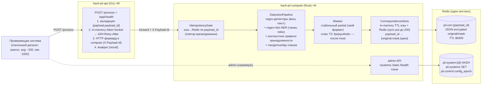

# HACK — Модуль безопасности персональных данных (PII-guard) за день

План вайбкодинга сервиса идентификации/маскирования/демаскирования ПД в
запросах к LLM. Контракт проверки — `POST /process` (Приложение A ТЗ):
синхронный `{payload, payload_id} → {result}`, направление (маска/демаска)
определяется по `payload_id`.

**Разделение на 2 сервиса:**

| Сервис | Язык | Роль |
|---|---|---|
| `hack-pii-api` | Go | Тонкий транспорт: валидация, rate limiter, форвард в compute |
| `hack-pii-compute` | Rust | Вся логика: детекция, маскирование, хранилище, admin-API, stats |

**Принятые решения (зафиксированы, с правками от вводных жюри 2026-09-22):**

| Решение | Выбор |
|---|---|
| Отношение к старому плану | Этот файл — источник истины. Паттерн split api/compute и Redis оставлен; очередь/Centrifugo/EDF не нужны |
| Split сервисов | Оставляем api Go + compute Rust (уже начат). Нагрузка слабее балансировщика — hop терпим, но api обязан быть тонким. Не плодим третий сервис |
| Движок детекции | Гибрид: regex+словари+checksum (структурные ПД) + regex+dict NER (ФИО, адреса, органы). Качество = recall/precision, не «похожесть маски на выдуманный эталон» |
| Маскирование | Стабильная частичная маска своего формата. Жюри всегда гоняет **нашу** маску, не чужой эталон. Смысл текста для LLM сохраняем |
| Обратимость | Store `payload_id → {original, mask}`: in-memory + Redis. `put` **синхронный до 200**. Демаска — lookup, без пайплайна |
| Путь обработки | Синхронный форвард api→compute. Без очереди |
| system_id | В контракте `/process` нет → default-policy. Admin `/systems` — плюс для жюри, не на критическом пути чекера |
| Наблюдаемость | Логи без значений ПД. Считаем mean / p50 / p95 / p99, `mask_ok` и `demask_ok` (должны совпасть), 429 отдельно |
| 429 | Не ошибка у жюри, но **пишется в статистику**. Не 429-ить демаску и ретраи. Headroom лимитера выше пика 1000 |
| Качество кода | ~6к правил (complexity, DRY, KISS, deprecated, грязный код) — gate zip. Клиппи/формат/короткие функции — must, не послесловие |

---

## 0A. Вводные организаторов (заморожены, 2026-09-22)

Ответы жюри — это требования скоринга. Они **важнее** догадок из кейса балансировщика и важнее выдуманного «эталона маски».

| # | Ответ жюри | Как читаем | Что делаем в коде |
|---|---|---|---|
| 1 | «Слабее» | Нагрузка слабее, чем в балансировщике / чем пугает цифра RPS 1000 в ТЗ | Не оптимизируем под постоянные 2000 RPS. Не тащим очереди, EDF, деление лимитов по подам. Пик 1000 обязан проходить с запасом CPU; средний режим ~330 RPS должен быть «скучным» (почти нулевые 429, p99 с запасом до 1с) |
| 2 | Автопроверка при zip / ручном запуске. Доступа к системе нет. Оценят последнюю версию сервиса | Чекер закрытый. Итерироваться по его логам нельзя. Поднимать «ещё разок» перед жюри нельзя | Selfcheck + load с разгоном — единственная обратная связь. Сервис держим живым. Zip пакуем скриптом (только исходники). Health готов **до** первого запроса |
| 3 | Нагрузка с **разгоном**, средний RPS **~330**, пики **до 1000**. 429 **не ошибка**, но **в статистике** | Чекер не бьёт 1000 с первой секунды. Холодный старт успеет прогреться. 429 не валит прогон, но портит картину | Token bucket с запасом (цель ≥1200–1500, не ровно 1000). Разгон симулируем в `demo/load.py`. 429 только при реальной перегрузке CPU, не «чтобы красиво отсечь». Считаем 429, но цель на пике 1000 — стремиться к нулю |
| 4 | Смотрят **все** метрики: средний, 99, 95, 50. **Число демасок = число масок** | Недостаточно удержать p95. Провальный p99 или высокий mean бьёт оценку. Сломанная демаска (429/500/промах store) ломает инвариант пары | `/stats` и selfcheck считают mean+p50+p95+p99. Демаска: fast-path, **без** семафора детекции, **без** 429. `put` в Redis завершён до ответа 200 на маску. TTL store ≥ длительности прогона (сутки, не час «на всякий») |
| 5 | «Всегда ваша маска» | На обратном шаге жюри шлёт **наш** `result`, не эталонную маску и не искажённый текст. Формат маски — наш | Lookup по точному совпадению `payload == stored.mask`. Не подгоняем Левенштейн к выдуманным `И. И. И.` / `45** ****56` как к gate. Маска должна: (а) закрыть ПД, (б) оставить смысл, (в) быть стабильной при ретрае |
| 6 | ~6к правил качества: complexity, DRY, KISS, deprecated, грязный код | Zip-проверка — **gate**: без неё решение не учитывается. Два языка = две поверхности | Коротко: маленькие функции, один детектор — один тип, без deprecated крейтов/API, без мёртвого кода и `todo!()` в релизе, `cargo clippy` + `fmt`, `gofmt` + `vet`. FPE/synthetic/четыре режима маски — после must-have |

### Инварианты скоринга (нарушил — проиграл пару/метрику)

1. **Pair invariant.** Каждый успешный mask по `payload_id` обязан иметь успешный demask с `result == original`. Счётчики равны.
2. **Your-mask invariant.** Demask получает ровно нашу строку. Store + exact match — правильная модель, не «вычислить обратную маску».
3. **No-PII-in-telemetry.** В логах и `/stats` нет значений ПД, только типы, длины, payload_id, тайминги.
4. **Zip gate.** Один `.zip` исходников, без `target/`, `node_modules`, датасетов, бинарников.
5. **Latency set.** Жюри смотрит mean, p50, p95, p99, не одну цифру.

---

## 0B. Оценка исходного плана (что оставить / что поменять)

План как playbook сильный: контракт `POST /process`, идемпотентность по `payload_id`, regex+checksum, контекст «Пушкин ≠ ПД», тонкий api, compute на Rust, без очереди. Это оставляем.

Где план промахнулся — он писался как продолжение **балансировщика** и угадывал скоринг.

| Тема | В исходном плане | Почему это проблема | Правка |
|---|---|---|---|
| Главная метрика маски | Span-based Левенштейн до выдуманного эталона ≤0.15 | Жюри: «всегда ваша маска». Эталонный формат не контракт | Gate: roundtrip 100% + покрытие типов ТЗ + мало FP. Формат маски — стабильный свой. Selfcheck эталона оставить как **регрессию стиля**, не как критерий сдачи |
| Нагрузка | RPS 1000 постоянно, бонус 2000, 429≈0 при ≤capacity | Среднее ~330, пик 1000, разгон, нагрузка слабее | Целевой режим: avg 330 без 429, пик 1000 без деградации p99. 2000 — опциональный плюс ТЗ, не трек дня |
| 429 | «контракт разрешает, режем в 1000» | 429 идёт в статистику. На пике 1000 лимитер=1000 начнёт 429-ить | Capacity с запасом. Демаска и cache-hit **не** проходят через семафор детекции |
| Redis `put` | Background, не блокирует 200 | Гонка: чекер сразу шлёт нашу маску обратно → miss → пара mask/demask разъедется | `put` write-through **до** 200. Фон — только реплика/метрики, не соответствие |
| TTL 3600 | Час | Длинный прогон / повтор демаски после паузы | Default TTL 86400. Ключ маленький относительно риска промаха |
| 4 режима маски + FPE | partial/fpe/synthetic/redact | ~6к правил + KISS. На чекере один режим | Must: один `partial`. FPE/synthetic — плюс ТЗ, отдельным треком после зелёного roundtrip |
| Admin `/systems` | На критическом пути архитектуры | В `/process` нет `system_id`. Чекер ходит в default | Default-policy в коде. Admin — демо гибкости (ТЗ «управлять правилами»), не блокер `/process` |
| СНИЛС | В 12 структурных детекторах | В ТЗ нет СНИЛС | Оставить (дешёвый checksum, не вредит), не тратить на него день |
| Даты | Любая дата → ПД | ТЗ: дата **рождения** и дата **выдачи паспорта**. Маскировать «12.01.2024» в обычном тексте — ложное срабатывание | DateDetector только с маркером (`родил`, `дата рождения`, `выдан`, `дата выдачи`) или рядом с паспортом/в/у |
| Адрес | Один спан на всю строку | ТЗ просит компоненты: страна, индекс, город, улица, дом, квартира | Детект компонентов + merge в адресный спан; индекс уже структурный |
| Шифрование | Ключ FPE в env, Redis plaintext | ТЗ: шифрование, ПД не в метриках. В Redis лежит original | AES/XOR original+mask в Redis ключом из env. Логи и так без значений |
| Инструкция настройки | Нет | ТЗ: ≤5 предложений | `README.md` на 5 предложений: env, compose, `/process`, `/systems`, что не логируем |
| Качество кода | «без комментариев» | 6к правил. `todo!()` и 200-строчные хендлеры не пройдут. Deprecated: смотреть версии axum/redis/tower | Трек 8: clippy -D warnings, go vet, запрет deprecated, zip-скрипт. Модульные `//!` допустимы; закомментированный код — нет |
| Selfcheck закрыт | Не акцентирован | Нет доступа к чекеру | Фикстуры по **всем** типам ТЗ + FP (Пушкин, адрес отделения) + roundtrip + разгон 330→1000 |

**Что не трогаем без нужды:** split Go/Rust уже начат — не схлопываем в один бинарь в день хакатона. Redis как источник соответствий — нужен, иначе рестарт/два пода ломают pair invariant.

**Приоритет (must → plus):**

1. Контракт `/process` + health + zip.
2. Все типы ПД из ТЗ + регистр + вариации написания.
3. Roundtrip 100% (pair invariant) + sync store.
4. FP: Пушкин / отделение банка; ПИН без карты — плюс ТЗ, настраиваемый.
5. Latency mean/p50/p95/p99 при разгоне 330→1000, минимум 429.
6. Логи без ПД, инструкция 5 предложений, admin default+systems.
7. Плюсы: FPE/synthetic, другие удостоверения, RPS 2000, гейт «маскировать только пачку типов».

---

## 0. Маппинг на требования ТЗ + жюри

| Требование | Как закрываем |
|---|---|
| Идентификация типов ПД (ТЗ 2.1) | Структурные: паспорт, в/у, ИНН, телефон, email, карта+Luhn, CVV, ПИН, дата рождения/выдачи (с маркером), индекс, код подразделения. NER/dict: ФИО, место рождения, адрес по компонентам, орган выдачи, гражданство, держатель карты. СНИЛС — необязательный extra |
| Принадлежность именно к ПД | Контекстное окно + словари знаменитостей и адресов отделений |
| Вариации написания (ТЗ 2.2) | Case-insensitive regex; даты числом и текстом; «серия … номер …» |
| Демаскирование, позиции (ТЗ 2.3) | Возврат сохранённого original по `payload_id`. Жюри шлёт нашу маску как есть |
| Pair invariant (жюри §4) | `mask_ok == demask_ok`; demask не 429; store.put до 200 |
| Логи типов ПД по запросу | payload_id, direction, types, spans offsets, timings — без values |
| Метрики Latency/RPS/TPS + жюри §4 | mean, p50, p95, p99, RPS, TPS, detections_by_type, mask_ok, demask_ok, count_429 |
| Список систем + гибкая настройка | Default-policy на `/process`; admin `/systems` для демо; README ≤5 предложений |
| Качество 95% | Recall/precision на фикстурах, не Левенштейн до чужой маски |
| 100 000 токенов | Regex одним проходом; NER чанками. Ожидаем редкие длинные запросы, не 330 RPS × 100k |
| Latency ≤1с, пик 1000, avg ~330 | Синхронный путь; словари на старте; лимитер с запасом; семафор только на detect |
| Идемпотентность ретраев | Lookup до пайплайна: тот же payload_id + тот же payload → тот же result |
| ПД не в логах/метриках + шифрование | Redact в tracing; original/mask в Redis шифруем; ключ в env |
| Расширяемость типов | Trait `Detector` + реестр + mask rule |
| Zip-проверка качества (~6к правил) | Скрипт упаковки; clippy/vet; короткие модули; без deprecated и мёртвого кода |
| Нагрузка с разгоном | `demo/load.py --ramp`; readiness: regex/dict preload до listen |

---

## 1. Что переиспользуем из балансировщика / что не нужно

**Переиспользуем (паттерн):**
1. Split `api`/`compute` — два отдельных сервиса (Go + Rust).
2. api — тонкий транспорт **без Redis**: валидация тела, in-memory rate limiter
   (429 + Retry-After), HTTP-форвард в compute, возврат `result`.
3. compute — вся логика: детекция, маскирование, хранилище соответствий,
   admin-API, `/stats`.
4. Redis как источник истины: соответствия `payload_id`, конфиги систем,
   control-эпоха.
5. In-memory кэш с TTL поверх Redis (write-through) — как `repo.py` в
   балансировщике.
6. In-memory rate limiter (token bucket) — как `limits.py`, но без EDF
   (приоритетов нет, все запросы равны).
7. Control-эпоха `config_epoch` для инвалидации кэшей конфигов на тике.
8. Структурированные логи `key=value` со стабильными префиксами.

**НЕ нужно (выкидываем против балансировщика):**
- Redis Streams / consumer group / PEL / outbox — обработка синхронная,
  внешних медленных вызовов нет.
- Centrifugo — ответ возвращается в том же HTTP-запросе.
- EDF/aging/PrioritySemaphore — приоритетов нет.
- WorkerRegistry/heartbeat — лимиты не делятся между подами статически
  (каждый compute-под самодостаточен; соответствие в Redis доступно всем).
- zstd-компрессия, Lua-скрипты, Keycloak.

---

## 2. Архитектура



**Путь запроса (маскирование, прямой шаг):**
1. Checker → api `POST /process {payload, payload_id}`.
2. api (Go): валидация схемы → rate limiter (перегруз → `429` + `Retry-After`) →
   форвард в compute с заголовком `X-Payload-Id`.
3. compute (Rust) `IdempotencyGate`: lookup `payload_id` в кэше/Redis.
   - найден и `payload == stored.original` → вернуть `stored.mask` (ретрай маски).
   - найден и `payload == stored.mask` → вернуть `stored.original` (демаска).
   - не найден → шаг 4.
4. `DetectionPipeline`: regex-детекторы по всему тексту + NER по
   чанкам → список спанов `(start, end, type, confidence)` → контекстное
   правило принадлежности → merge пересечений.
5. `Masker`: для каждого спана — маска по правилу типа (partial по умолчанию) →
   `masked_text`.
6. `CorrespondenceStore.put(payload_id, original, masked_text, types)` —
   кэш + Redis **синхронно** (write-through, TTL 86400). 200 только после
   успешного put — иначе чекер сразу шлёт нашу маску и pair invariant падает.
7. api возвращает `200 {"result": masked_text}`.

**Путь запроса (демаскирование, обратный шаг):** шаги 1–3; на шаге 3
`payload == stored.mask` → вернуть `stored.original`. Детекция/маскирование
не вызываются.

**Идемпотентность и направление:** направление НЕ передаётся явно — выводится
из состояния хранилища по `payload_id` (контракт: «первый запрос с новым
payload_id — маскирование; второй с тем же — демаскирование»). Ретраи
безопасны: тот же `payload_id` + тот же `payload` → тот же `result`.

**Почему без очереди:** обработка CPU-bound и быстрая (нет внешних LLM-вызовов);
контракт синхронный (result в том же ответе); очередь добавила бы латентность
и сложность без выигрыша. Отказоустойчивость — на уровне: идемпотентные
ретраи, 429 при перегрузке, Redis для соответствий (переживает рестарт пода).

---

## 3. Redis-структуры (неймспейс `pii:`)

| Ключ | Тип | Назначение | TTL |
|---|---|---|---|
| `pii:corr:{payload_id}` | STRING (JSON, **шифрованный** original/mask) | `{original, mask, types[], created_ts}` — соответствие для обратного шага и идемпотентности | 86400с (`PII_CORR_TTL_SEC`) |
| `pii:system:{system_id}` | HASH | `enabled`, `types` (csv или `all`), `mask_mode`, `demask_enabled` | — |
| `pii:systems` | SET | Индекс system_id | — |
| `pii:control:config_epoch` | STRING | `time_ns()` последней мутации `/systems` — инвалидация кэшей | — |

In-memory кэш соответствий: LRU+TTL (max `PII_CACHE_MAX`, default 100 000),
write-through в Redis. Кэш конфигов систем: TTL 2с.

---

## 4. Алгоритмы

### 4.1 Нормализация и регистронезависимость

Детекция не зависит от регистра: все regex компилируются с `(?i)` (Go) /
`set_case_insensitive(true)` (Rust); для NER-маркеров («паспорт», «серия»,
«гражданство») — casefold-словари. Позиции спанов — в координатах ИСХОДНОГО
текста (маскирование не меняет индексы до применения; применяем спаны справа
налево).

### 4.2 Структурные детекторы (regex + валидация)

Каждый детектор — `(pattern, validator, type, mask_rule)`. Валидация
снижает ложные срабатывания (требование «мало ложных срабатываний»).

| Тип | Pattern (упрощённо, все case-insensitive) | Валидация | Маска (стиль эталона) |
|---|---|---|---|
| Паспорт РФ | `серия?\s*(\d{4})\s*(?:номер?\s*)?(\d{6})` ИЛИ `паспорт.{0,20}?(\d{4})\s*(\d{6})` ИЛИ `\b(\d{4})\s(\d{6})\b` при маркере «паспорт» | серия 4 цифр, номер 6 цифр | `45** ****56` (2+** / ****+2) |
| В/У | `(?:в/у\|водительск).{0,20}?(\d{2})\s?([А-ЯA-Z]{2})\s?(\d{6})` ИЛИ `\b(\d{2})\s?\d{2}\s?\d{6}\b` при маркере | регион 01–99 | `77** ****78` |
| ИНН | `\b(\d{10}\|\d{12})\b` при маркере «инн» ИЛИ рядом с ФИО | контрольные цифры ИНН (алгоритм ФНС) | `77** ****** 28` (2+**…**+2) |
| СНИЛС | `\b(\d{3})-(\d{3})-(\d{3})\s?(\d{2})\b` | контрольное число СНИЛС | `123-***-*** **` |
| Телефон | `(?:\+7\|8)\s?[\(]?\d{3}[\)]?\s?\d{3}[-\s]?\d{2}[-\s]?\d{2}` | 11 цифр, код оператора | `+7 9** ***-**-89` |
| Email | стандартный RFC-упрощённый | — | `i*******@bank.ru` (1-й символ + домен) |
| Карта | `\b(\d{4}[\s-]?){3}\d{4}\b` (16–19 цифр) | алгоритм Луна | `4111 **** **** 1111` (BIN4+last4) |
| CVV | `(?:cvv\|cvc\|код безопасности).{0,10}?(\d{3}\|\d{4})` | 3–4 цифры | `***` |
| ПИН | `(?:пин\|pin).{0,15}?(\d{4})` | 4 цифры | `***` (**гейт**: маскируется только если в том же payload есть карта — §6 ТЗ; настраивается) |
| Дата рождения / выдачи | те же паттерны дат **только** при маркере `родил*`, `дата рождения`, `выдан`, `дата выдачи` или рядом со спаном паспорт/в/у | месяц 1–12, день по месяцу, год 1900–2100; голая дата в тексте — не ПД | `**.**.1990` (год сохранён, смысл для LLM) |
| Индекс | `(?:индекс\|почтовый код).{0,10}?(\d{6})` ИЛИ `\b(\d{6})\b` при маркере адреса | 100000–699999 | `******` |
| Код подразделения | `\b(\d{3})-(\d{3})\b` при маркере «код подразделения»/«выдан» | — | `***-***` |

### 4.3 NER (ФИО, адреса, органы, организации) — regex+dict на Rust

Вместо Natasha (Python) — regex+словари на Rust:

- **ФИО**: паттерн `[А-ЯЁ][а-яё]+\s+[А-ЯЁ][а-яё]+\s+[А-ЯЁ][а-яё]+` (3 слова
  с заглавной буквы) + словарь фамилий/имён (casefold). Для 2-словных ФИО —
  только при маркере рядом.
- **Адреса**: паттерн `(?:г\.|ул\.|пр\.|пер\.|бульвар|проспект)\s+...` +
  AddrExtractor-подобная логика (цепочки «город, улица, дом, квартира»).
- **Органы**: паттерн при маркерах «выдан», «отделение», «УФМС», «МВД», «ГУ».
- **Организации**: паттерн при маркерах «гражданство», «работодатель».

Предзагрузка словарей при старте compute. Чанкование: `PII_NER_CHUNK_CHARS`
(default 4000) с перекрытием `PII_NER_OVERLAP` (default 200). Спаны из чанков
сдвигаем на offset чанка; дубли в зоне перекрытия дедуплицируем по
`(type, start, end)`. Параллельная обработка чанков — `tokio::task::spawn_blocking`.

Извлечение типов:
- PER → ФИО / держатель карты (если рядом маркер «карта»/«держатель»).
- LOC + address → адрес / место рождения (маркер «родился/место рождения»).
- ORG → орган выдачи (маркер «выдан/отделение/УФМС/МВД/ГУ») / гражданство
  (маркер «гражданство/гражданин»).

### 4.4 Контекстное правило принадлежности (Пушкин ≠ ПД)

NER-сущность считается ПД **только если** выполнено хотя бы одно:
1. В окне `PII_CONTEXT_WINDOW` (default 200 символов) есть **структурный ПД**
   (паспорт/ИНН/карта/телефон/email/дата рождения) — «данные именно о человеке».
2. Рядом (в том же окне) **ПД-маркер**: `клиент, заемщик, паспорт, родился,
   родилась, место рождения, адрес, проживает, гражданин, гражданство,
   держатель, получатель, заявитель`.
3. Сущность непосредственно следует за маркером типа («ФИО: …», «адрес: …»).

Исключения (не ПД даже при правиле выше, если нет структурного ПД):
- Словарь знаменитостей (`Пушкин, Лермонтов, Толстой, …`) — PER.
- Словарь адресов отделений/организаций банка — LOC/ORG (детектируется по
  маркерам «отделение, офис, филиал, банк по адресу»).

Словари расширяемые (файлы `dicts/famous.txt`, `dicts/org_addresses.txt`).

### 4.5 Merge спанов и разрешение пересечений

1. Собрать все спаны (regex + NER) → отсортировать по `start`.
2. Пересечения: предпочесть структурный детектор (выше confidence) и более
   длинный спан; вложенный спан поглощается внешним того же типа.
3. ПИН без карты (гейт §6) — отбрасывается на этом этапе.
4. Итог — непересекающийся список спанов для маскирования.

### 4.6 Маскирование (один must-режим)

Must-have на чекере — один режим `partial`: стабильная частичная маска
своего формата (структура/часть символов сохраняется, смысл для LLM жив).
Жюри всегда гоняет **нашу** строку, поэтому подгонка под чужой эталон
не скорит.

`mask_mode` в `SystemConfig` (default `partial`) — плюс ТЗ «гибкая настройка
вида маскирования», не блокер `/process`:
- `partial` — must, таблица §4.2.
- `fpe` / `synthetic` / `redact` — только после зелёного roundtrip и clippy.

Применение: спаны справа налево, `text[:s] + mask + text[e:]`. Demask не
инвертирует маску — возвращает сохранённый original.

### 4.7 Два лимита (надёжность под нагрузкой)

Нагрузка жюри: **разгон**, среднее **~330 RPS**, пики **до 1000**, нагрузка
**слабее** балансировщика. 429 не ошибка, но попадает в статистику — цель
на пике 1000 всё равно «почти нулевые 429».

Два лимита, без EDF/aging и без деления на поды:

**Лимит 1 — RPS (token bucket, api-под на Go).** Режет поток ДО compute.
```
capacity = PII_RPS_TARGET (default 1500, не 1000), refill = capacity/sec
acquire(): токен есть -> пропустить; нет -> 429 + Retry-After: 1
```
Headroom нужен потому что пик 1000 при capacity 1000 даёт ложные 429 из-за
джиттера. 429 только при реальном превышении, не как «красивый предохранитель».

**Лимит 2 — Concurrency (tokio::sync::Semaphore, compute-под на Rust).** Режет
CPU только у **детекции**. Lookup (ретрай маски / любая демаска) семафор
**не берёт** — иначе pair invariant ломается: маска прошла, демаска получила 429.
```
cap = PII_MAX_CONCURRENT (default = num_cpus::get())
acquire() с bounded wait только на miss store (нужен пайплайн):
    match tokio::time::timeout(Duration::from_secs_f64(sem_wait_sec), sem.acquire()).await {
        Ok(permit) => ... // пропустить detect
        Err(_) => 429 + Retry-After: 1
    }
```
Правило «wait ≤ 0.3с, иначе 429»: сглаживает микро-всплески, не даёт p99
уползти за 1с.

Разделение по подам: RPS-bucket на **api** (на хакатон 1 api-под, capacity
уже с запасом), concurrency-semaphore — на **каждом compute-поде**.
Счётчики `count_429_rps` и `count_429_sem` — в `/stats`. Отдельно:
`mask_ok`, `demask_ok` — должны совпадать на всём прогоне.

### 4.8 Бюджет латентности (цель: mean и p99 с запасом до 1с)

Жюри смотрит **средний, 50, 95, 99** — нельзя «протащить» p95 ценой хвоста p99.

| Этап | Бюджет |
|---|---|
| Валидация + idempotency lookup (кэш-hit / демаска) | <2мс |
| Regex-детекторы (весь текст) | 10–50мс |
| NER (чанки параллельно, spawn_blocking) | 100–400мс (типичный текст), до ~800мс на 100k токенов |
| Merge + маскирование | <5мс |
| Redis put (**синхронно**, до 200) | ~1–3мс |
| Итого (типичный payload, avg 330 RPS) | ~150–500мс, p99 <1с |

Демаска и ретрай не ходят в NER. Словари/regex компилируются **до** bind порта
(разгон чекера не спасает, если первый запрос пришёл на холодный listen).
Число одновременных **detect**-пайплайнов ограничено семафором (§4.7).

---

## 5. API

### 5.1 Публичный (api-под на Go): `POST /process`

```http
POST /process
Content-Type: application/json

{"payload": "Клиент Иванов Иван Иванович, паспорт 4509 123456",
 "payload_id": "8a77d363c7c044b49b41d7b8a448243a"}
```

Ответы:
| Ситуация | Код | Кто решил |
|---|---|---|
| Успех (маска или демаска) | 200 `{"result": "..."}` | compute |
| Нет/битое тело (`payload`/`payload_id` отсутствуют) | 422 | api |
| Перегруз rate limiter'а | 429 + `Retry-After` | api |
| compute недоступен (ConnectError) | 502 | api |
| compute не ответил (timeout `PII_FORWARD_TIMEOUT_SEC`=9) | 504 | api |
| Внутренняя ошибка compute | 500 | compute |

`GET /app/health` → `{"status":"ok","compute":bool}` (всегда 200).

### 5.2 Внутренний (compute-под на Rust): `POST /process`

Тот же контракт (только от api). Логика §2 шаги 3–7. Заголовок `X-Payload-Id`
дублирует `payload_id` тела (корреляция в логах).

### 5.3 Admin (compute-под на Rust, напрямую)

```
POST /systems   {"system_id","enabled":true,"types":"all"|[...],
                  "mask_mode":"partial","demask_enabled":true}  → HSET+SADD+epoch++
GET  /systems   → список SystemConfig
GET  /stats     → {"rps":..,"latency_mean_ms":..,"latency_p50_ms":..,
                    "latency_p95_ms":..,"latency_p99_ms":..,"tokens_per_sec":..,
                    "detections_by_type":{...},"cache_hit_rate":..,"count_429":..,
                    "mask_ok":..,"demask_ok":..,"requests_total":..,"corr_store_size":..}
GET  /health    → {"status":"ok","redis":bool,"role":"worker"}
POST /clear     → config_epoch++ (сброс кэшей конфигов)
```

`/process` использует default-policy (system_id в запросе нет): `types=all`,
`mask_mode=partial`, `demask_enabled=true`. Per-system конфиги — capability для
реальных интеграций (ТЗ §4.4 «управлять правилами для разных систем»).

---

## 6. Структура проектов

### 6.1 `hack-pii-api` (Go)

```
hack-pii-api/
├── main.go                  # запуск HTTP-сервера
├── go.mod
├── go.sum
├── internal/
│   ├── config/
│   │   └── config.go        # env: PII_COMPUTE_URL, PII_RPS_TARGET=1500,
│   │                        #   PII_FORWARD_TIMEOUT_SEC=9, PII_APP_PORT=8080
│   ├── handler/
│   │   ├── process.go       # POST /process: валидация → rate limit → forward
│   │   └── health.go        # GET /app/health
│   ├── middleware/
│   │   ├── ratelimit.go     # token bucket middleware → 429 + Retry-After
│   │   └── logging.go       # структурированные логи key=value (slog)
│   ├── forwarder/
│   │   └── forwarder.go     # http.Client → compute POST /process
│   └── ratelimit/
│       └── bucket.go        # InMemoryTokenBucket (capacity, refill/sec)
├── Dockerfile
└── internal/testdata/       # тестовые фикстуры
```

**Зависимости Go:** `net/http` (stdlib), `log/slog` (stdlib), `encoding/json`
(stdlib), `github.com/go-chi/chi/v5` (роутер), `github.com/redis/go-redis/v9`
(НЕ нужен для api — api без Redis). Dev: stdlib `testing`.

### 6.2 `hack-pii-compute` (Rust)

```
hack-pii-compute/
├── Cargo.toml
├── src/
│   ├── main.rs              # запуск axum-сервера, role=worker
│   ├── config.rs            # env: REDIS_URL, NS="pii", CORR_TTL_SEC=86400,
│   │                        #   CACHE_MAX=100000, MAX_CONCURRENT=cpus,
│   │                        #   SEM_WAIT_SEC=0.3, NER_CHUNK_CHARS=4000,
│   │                        #   NER_OVERLAP=200, CONTEXT_WINDOW=200,
│   │                        #   FPE_KEY, APP_PORT=8080
│   ├── models.rs            # ProcessRequest, ProcessResponse, Span,
│   │                        #   SystemConfig, CorrRecord (serde)
│   ├── redis_client.rs      # redis::Client + ConnectionManager
│   ├── keys.rs              # corr_key, system_key, systems_set, config_epoch_key
│   ├── repo.rs              # CRUD SystemConfig в Redis + TTL-кэш 2с + epoch++
│   ├── store.rs             # CorrespondenceStore: LRU+TTL кэш + Redis write-through
│   ├── ratelimit.rs         # ConcurrencySemaphore (tokio::sync::Semaphore + timeout)
│   ├── stats.rs             # in-memory агрегатор (RPS окно, latency, TPS, детекты)
│   ├── pipeline.rs          # DetectionPipeline: detect→context→merge→mask
│   ├── logging.rs           # tracing: key=value, фильтр ПД
│   ├── detect/
│   │   ├── mod.rs
│   │   ├── base.rs          # trait Detector: detect(&str)->Vec<Span>; DetectorRegistry
│   │   ├── structural.rs    # regex-детекторы + валидаторы (Луна, ИНН, СНИЛС, даты)
│   │   ├── ner.rs           # regex+dict NER: чанки, spawn_blocking, offset, dedup
│   │   ├── context.rs       # правило принадлежности + словари famous/org_addresses
│   │   └── merge.rs         # sort + overlap resolution + ПИН-гейт
│   ├── mask/
│   │   ├── mod.rs
│   │   ├── rules.rs         # per-type mask-функции (стиль эталона)
│   │   ├── fpe.rs           # формат-сохраняющее шифрование (опц. режим)
│   │   └── masker.rs        # Masker: apply spans right-to-left; режим per system
│   ├── dicts/
│   │   ├── famous.txt
│   │   ├── org_addresses.txt
│   │   ├── markers.txt
│   │   └── months.txt
│   ├── routers/
│   │   ├── mod.rs
│   │   ├── process.rs       # POST /process: idempotency→semaphore→pipeline→store
│   │   └── admin.rs         # /systems /stats /health /clear
│   └── app_state.rs         # AppState: shared handles (redis, store, pipeline, ...)
├── tests/
│   ├── test_structural.rs
│   ├── test_ner.rs
│   ├── test_context.rs
│   ├── test_merge.rs
│   ├── test_mask.rs
│   ├── test_store.rs
│   ├── test_ratelimit.rs
│   ├── test_pipeline.rs
│   └── test_e2e.rs
├── Dockerfile
└── dicts/                   # symlink → src/dicts/ или include_str!
```

**Зависимости Rust:** `axum`, `tokio` (full), `serde` + `serde_json`, `redis`
(async, tokio-comp), `regex`, `tracing` + `tracing-subscriber`, `uuid`,
`num_cpus`, `lru`. Dev: `tower` (для тестов), `mockall`.

### 6.3 Общие файлы

```
hack-pii/
├── docker-compose.yml       # redis + api (Go) + compute (Rust)
├── process_api.yaml         # OpenAPI-спека контракта (Приложение A)
├── demo/
│   ├── load.py              # разгон avg 330 → пик 1000, пары payload_id, mean/p50/p95/p99, mask_ok==demask_ok
│   └── selfcheck.py         # все типы ТЗ + FP (Пушкин) + roundtrip 100%; стиль маски — регрессия, не gate
└── hack.md                  # этот файл
```

---

## 7. Контракт данных

```json
// ProcessRequest
{"payload": "string", "payload_id": "string"}

// ProcessResponse
{"result": "string"}

// Span (внутренний, для логов/метрик)
{"start": 0, "end": 0, "type": "passport", "confidence": 1.0, "source": "regex"}

// CorrRecord (внутренний, для Redis)
{"original": "string", "mask": "string", "types": ["fio", "passport"], "created_ts": 0.0}

// SystemConfig (внутренний, для Redis + admin)
{"system_id": "string", "enabled": true, "types": "all", "mask_mode": "partial", "demask_enabled": true}
```

---

## 8. Multi-instance: чек-лист корректности

| Механизм | Почему работает при M api × N compute |
|---|---|
| api stateless (Go) | RPS-bucket локальный на api (доля = capacity/M — или общий за L7); любой api-под форвардит любой запрос |
| Concurrency на compute (Rust) | Semaphore локален на каждом compute-поде (защищает свой CPU); соответствие в Redis, а не в лимитах → поды независимы |
| Соответствия в Redis | Демаска по `payload_id` работает на любом compute-поде (кэш-write-through); рестарт пода не теряет данные |
| Идемпотентность | Lookup до обработки: ретрай маски/демаски → тот же result независимо от пода |
| Конфиги систем | Redis HASH + кэш 2с + config_epoch — инвалидация на всех подах |
| Перегруз | 429 + Retry-After из двух точек: RPS-bucket на api (поток >> 1500) и concurrency-semaphore на compute **только для detect**. Lookup/демаска не 429-ятся семафором. 429 не ошибка у жюри, но портит статистику |
| Redis упал | Pair invariant ломается между подами. На хакатоне Redis — must. Деградация: in-memory кэш на том же поде ещё отдаст демаску; новые put без Redis → **не отдаём 200**, иначе чекер не сможет демаскировать |

---

## 9. План работ: параллельные треки

Фундамент (треки 0A и 0B) — каркасы обоих сервисов. Затем параллельно
треки 1–5, интеграция — трек 6.

```mermaid
gantt
    dateFormat HH:mm
    axisFormat %H:%M
    section Фундамент
    T0A Go api каркас+контракт+ratelimit :crit, 00:00, 30m
    T0B Rust compute каркас+контракт+store+ratelimit :crit, 00:00, 45m
    section Параллельно
    T1 Rust detect/structural + валидаторы + tests   :00:45, 75m
    T2 Rust detect/ner + context + merge + tests     :00:45, 90m
    T3 Rust mask/* + dicts + tests                   :00:45, 60m
    T4 Rust compute: pipeline + routers + admin      :01:30, 75m
    T5 Go api: relay + ratelimit + main              :00:30, 45m
    section Интеграция
    T6 сборка + e2e + selfcheck + compose + zip  :crit, 02:45, 90m
    section Демо
    T7 load разгон 330→1000 + mean/p50/p95/p99   :04:15, 60m
    T8 clippy/vet + 6к-правил + README 5 предл.  :crit, 05:15, 30m
    Резерв                                       :05:45, 15m
```

---

### Трек 0A (параллельно с 0B, ~30 мин): Go api — каркас, контракт, ratelimit

> **Промпт 0A:**
>
> Создай каркас Go-проекта `hack-pii-api` — тонкий транспорт для PII-модуля
> (хакатон, один день, код без комментариев). Стек: Go 1.22+, `chi/v5`,
> stdlib `net/http`, `log/slog`, `encoding/json`.
>
> Файлы:
> 1. `go.mod` — модуль `hack-pii-api`, Go 1.22. Зависимости: `github.com/go-chi/chi/v5`.
> 2. `internal/config/config.go` — `Config` struct:
>    ```go
>    type Config struct {
>        ComputeURL        string        // env PII_COMPUTE_URL, обязателен
>        RpsTarget         int           // env PII_RPS_TARGET, default 1500
>        ForwardTimeoutSec float64       // env PII_FORWARD_TIMEOUT_SEC, default 9.0
>        AppPort           int           // env PII_APP_PORT, default 8080
>        AppHost           string        // env PII_APP_HOST, default "0.0.0.0"
>    }
>    ```
>    Функция `Load() (*Config, error)` — читает env, валидирует ComputeURL непустой.
> 3. `internal/ratelimit/bucket.go` — `TokenBucket`:
>    ```go
>    type TokenBucket struct { ... }
>    func NewTokenBucket(capacity int, refillPerSec int) *TokenBucket
>    func (tb *TokenBucket) Acquire() bool
>    ```
>    Алгоритм: при каждом Acquire вычислить elapsed = now - lastRefill,
>    tokens = min(capacity, tokens + elapsed * refillPerSec), lastRefill = now.
>    Если tokens >= 1 → tokens -= 1, вернуть true. Иначе false.
>    Защита от шага часов назад: elapsed = max(0, elapsed). Thread-safe (sync.Mutex).
> 4. `internal/forwarder/forwarder.go` — `Forwarder`:
>    ```go
>    type Forwarder struct { client *http.Client, computeURL string }
>    func NewForwarder(computeURL string, timeout time.Duration) *Forwarder
>    func (f *Forwarder) Forward(ctx context.Context, payload, payloadID string) (*ProcessResponse, error)
>    ```
>    POST `{computeURL}/process` с JSON телом и заголовком `X-Payload-Id`.
>    Возвращает ошибку `ErrComputeUnavailable` (ConnectError) или
>    `ErrComputeTimeout` (timeout).
> 5. `internal/handler/process.go` — `ProcessHandler`:
>    ```go
>    type ProcessHandler struct { bucket *TokenBucket, fwd *Forwarder }
>    func (h *ProcessHandler) ServeHTTP(w http.ResponseWriter, r *http.Request)
>    ```
>    1. Парсинг JSON тела → `ProcessRequest{Payload, PayloadID}`.
>    2. Валидация: `payload` и `payload_id` непустые → иначе 422.
>    3. Rate limiter: `bucket.Acquire()` → false: 429 + `Retry-After: 1`.
>    4. Форвард: `fwd.Forward(ctx, req.Payload, req.PayloadID)`.
>    5. Ответ: 200 `{"result": "..."}` или 502/504 при ошибках.
> 6. `internal/handler/health.go` — `GET /app/health` → `{"status":"ok","role":"api"}`.
> 7. `internal/middleware/logging.go` — slog middleware: метод, путь, статус,
>    длительность, payload_id (НЕ payload). Формат key=value (slog.TextHandler).
> 8. `main.go` — загрузка конфига, создание chi-роутера, middleware, хендлеры,
>    `http.ListenAndServe`.
> 9. `internal/models/models.go` — `ProcessRequest{Payload, PayloadID string}`,
>    `ProcessResponse{Result string}` (json tags).
> 10. Тесты:
>     - `internal/ratelimit/bucket_test.go`:
>       - `TestTokenBucketCapacity` — capacity=3 → 3 Acquire true, 4-й false.
>       - `TestTokenBucketRefill` — capacity=1, refill=10/sec → Acquire false →
>         sleep 150ms → Acquire true.
>       - `TestTokenBucketConcurrent` — 10 goroutine, capacity=5 → ровно 5 true.
>     - `internal/handler/process_test.go` (httptest):
>       - `TestProcessForwardSuccess` — mock compute → 200 → api → 200.
>       - `TestProcess429RateLimit` — bucket пуст → 429 + Retry-After.
>       - `TestProcess422InvalidBody` — пустое тело → 422.
>       - `TestProcess502ComputeUnavailable` — mock transport error → 502.
>       - `TestProcess504ComputeTimeout` — mock timeout → 504.
>       - `TestProcessPassthrough429` — compute вернул 429 → api вернул 429.
>     - `internal/handler/health_test.go`:
>       - `TestHealth` — GET /app/health → 200.
>
> **Критерии приёмки трека 0A:**
> - [ ] `go build ./...` — без ошибок.
> - [ ] `go test ./...` — все тесты зелёные.
> - [ ] `PII_COMPUTE_URL=http://localhost:8081 go run main.go` — стартует на :8080.
> - [ ] В коде нет комментариев.

---

### Трек 0B (параллельно с 0A, ~45 мин): Rust compute — каркас, контракт, store, ratelimit

> **Промпт 0B:**
>
> Создай каркас Rust-проекта `hack-pii-compute` — вычислительный сервис для
> PII-модуля (хакатон, один день, код без комментариев). Стек: Rust 2021,
> `axum`, `tokio`, `serde`, `serde_json`, `redis` (async, tokio-comp).
>
> Файлы:
> 1. `Cargo.toml` — зависимости: `axum = "0.7"`, `tokio = { version = "1", features = ["full"] }`,
>    `serde = { version = "1", features = ["derive"] }`, `serde_json`,
>    `redis = { version = "0.25", features = ["tokio-comp", "connection-manager"] }`,
>    `tracing`, `tracing-subscriber`, `uuid = { version = "1", features = ["v4"] }`,
>    `num_cpus`, `lru`, `tower`, `tower-http`. Dev: `tower` (ServiceExt для тестов).
> 2. `src/config.rs`:
>    ```rust
>    pub struct Config {
>        pub redis_url: String,          // env REDIS_URL, default "redis://localhost:6379/0"
>        pub ns: String,                 // env PII_NS, default "pii"
>        pub corr_ttl_sec: u64,          // env PII_CORR_TTL_SEC, default 86400
>        pub cache_max: usize,           // env PII_CACHE_MAX, default 100_000
>        pub max_concurrent: usize,      // env PII_MAX_CONCURRENT, default num_cpus::get()
>        pub sem_wait_sec: f64,          // env PII_SEM_WAIT_SEC, default 0.3
>        pub ner_chunk_chars: usize,     // env PII_NER_CHUNK_CHARS, default 4000
>        pub ner_overlap: usize,         // env PII_NER_OVERLAP, default 200
>        pub context_window: usize,      // env PII_CONTEXT_WINDOW, default 200
>        pub fpe_key: String,            // env PII_FPE_KEY, default ""
>        pub app_host: String,           // env PII_APP_HOST, default "0.0.0.0"
>        pub app_port: u16,              // env PII_APP_PORT, default 8080
>    }
>    ```
>    Функция `Config::from_env() -> Self`.
> 3. `src/models.rs` — РОВНО эти модели (контракт, замораживается):
>    ```rust
>    #[derive(Serialize, Deserialize)]
>    pub struct ProcessRequest { pub payload: String, pub payload_id: String }
>
>    #[derive(Serialize, Deserialize)]
>    pub struct ProcessResponse { pub result: String }
>
>    #[derive(Clone, Serialize, Deserialize)]
>    pub struct Span {
>        pub start: usize, pub end: usize, pub type_: String,
>        pub confidence: f64, pub source: String,
>    }
>
>    #[derive(Clone, Serialize, Deserialize)]
>    pub struct CorrRecord {
>        pub original: String, pub mask: String,
>        pub types: Vec<String>, pub created_ts: f64,
>    }
>
>    #[derive(Clone, Serialize, Deserialize)]
>    pub struct SystemConfig {
>        pub system_id: String, pub enabled: bool,
>        pub types: String, pub mask_mode: String, pub demask_enabled: bool,
>    }
>    ```
>    (используй `#[serde(rename = "type")]` для `type_`).
> 4. `src/keys.rs` — хелперы ключей:
>    ```rust
>    pub fn corr_key(ns: &str, payload_id: &str) -> String
>    pub fn system_key(ns: &str, system_id: &str) -> String
>    pub fn systems_set(ns: &str) -> String
>    pub fn config_epoch_key(ns: &str) -> String
>    ```
> 5. `src/redis_client.rs` — `async fn make_redis(url: &str) -> redis::Result<ConnectionManager>`.
> 6. `src/repo.rs` — `Repo`:
>    ```rust
>    pub struct Repo { conn: ConnectionManager, ns: String, cache: Arc<Mutex<SystemCache>> }
>    pub async fn save_system(&self, config: &SystemConfig) -> redis::Result<()>
>    pub async fn get_system(&self, system_id: &str) -> redis::Result<Option<SystemConfig>>
>    pub async fn list_systems(&self) -> redis::Result<Vec<SystemConfig>>
>    pub async fn bump_config_epoch(&self) -> redis::Result<()>
>    pub async fn get_control_epoch(&self) -> redis::Result<i64>
>    ```
>    In-memory TTL-кэш конфигов на 2 секунды (HashMap + Instant; инвалидация при save).
> 7. `src/store.rs` — `CorrespondenceStore`:
>    ```rust
>    pub struct CorrespondenceStore { conn: ConnectionManager, ns: String, ttl_sec: u64, cache: Arc<Mutex<LruCache<String, CorrRecord>>> }
>    pub async fn get(&self, payload_id: &str) -> Result<Option<CorrRecord>>
>    pub async fn put(&self, payload_id: &str, original: &str, mask: &str, types: Vec<String>) -> Result<()>
>    pub async fn lookup(&self, payload_id: &str, payload: &str) -> Result<Option<(String, String)>>
>    ```
>    LRU+TTL кэш in-memory (lru crate + timestamp). `get`: сначала кэш, иначе
>    Redis GET + decrypt + парсинг JSON → положить в кэш. `put`: кэш + Redis SET
>    с TTL **синхронно** (write-through, шифруем original/mask). 200 на маску
>    только после успешного put. `lookup`: идемпотентный — если record найден и
>    payload == record.original → вернуть record.mask; если payload == record.mask
>    → вернуть record.original; иначе None.
> 8. `src/ratelimit.rs` — `ConcurrencySemaphore`:
>    ```rust
>    pub struct ConcurrencySemaphore { sem: Arc<Semaphore>, wait: Duration }
>    pub async fn acquire(&self) -> bool
>    ```
>    `tokio::time::timeout(wait, self.sem.acquire())` → Ok = true, Err = false.
> 9. Пустые заглушки (только сигнатуры, тела `todo!()`): `src/detect/base.rs`,
>    `src/detect/structural.rs`, `src/detect/ner.rs`, `src/detect/context.rs`,
>    `src/detect/merge.rs`, `src/mask/rules.rs`, `src/mask/fpe.rs`,
>    `src/mask/masker.rs`, `src/pipeline.rs`, `src/stats.rs`, `src/logging.rs`,
>    `src/routers/process.rs`, `src/routers/admin.rs`, `src/app_state.rs`.
> 10. `src/main.rs` — заглушка: загрузка конфига, axum Router с `/health` → "ok",
>     `tokio::main`, bind на `app_host:app_port`.
> 11. Тесты:
>     - `tests/test_keys.rs`:
>       - `test_corr_key` — corr_key("pii", "id1") == "pii:corr:id1".
>       - `test_system_key` — system_key("pii", "s1") == "pii:system:s1".
>       - `test_systems_set` — systems_set("pii") == "pii:systems".
>       - `test_config_epoch_key` — config_epoch_key("pii") == "pii:control:config_epoch".
>     - `tests/test_ratelimit.rs`:
>       - `test_semaphore_capacity` — cap=2 → 2 acquire проходят; 3-й виснет.
>       - `test_semaphore_wait_timeout` — cap=1, wait=100ms → 1-й ок → 2-й → false через ~100ms.
>       - `test_semaphore_release` — cap=1 → acquire → drop permit → acquire → ок.
>     - `tests/test_config.rs`:
>       - `test_config_defaults` — Config::from_env() с пустыми env → дефолты.
>       - `test_config_from_env` — monkeypatch env → подхватывается.
>
> **Критерии приёмки трека 0B:**
> - [ ] `cargo build` — без ошибок.
> - [ ] `cargo test` — все тесты зелёные.
> - [ ] `cargo run` стартует axum на :8080, GET /health → 200.
> - [ ] `src/models.rs` совпадает с контрактом §7: имена полей, типы — буквально.
> - [ ] Заглушки остальных модулей компилируются и содержат только сигнатуры + `todo!()`.
> - [ ] В коде нет комментариев.

---

### Трек 1 (параллельно, ~75 мин): Rust `detect/structural.rs` — regex-детекторы + валидаторы

> **Промпт 1:**
>
> Ты пишешь два модуля для хакатонного PII-модуля на Rust (без комментариев):
> базовый trait детектора и все regex-детекторы для структурных ПД с валидаторами
> checksum. Файлы: `src/detect/base.rs`, `src/detect/structural.rs`,
> `tests/test_structural.rs`. НЕ трогай другие файлы проекта.
>
> Контракт (уже существует): `src/models.rs`:
> ```rust
> pub struct Span { pub start: usize, pub end: usize, pub type_: String,
>                   pub confidence: f64, pub source: String }
> ```
>
> **Файл 1: `src/detect/base.rs`**
> ```rust
> pub trait Detector: Send + Sync {
>     fn detect(&self, text: &str) -> Vec<Span>;
> }
>
> pub struct DetectorRegistry { detectors: Vec<Box<dyn Detector>> }
> impl DetectorRegistry {
>     pub fn new() -> Self
>     pub fn register(&mut self, detector: Box<dyn Detector>)
>     pub fn detect_all(&self, text: &str) -> Vec<Span>
> }
> ```
>
> **Файл 2: `src/detect/structural.rs`** — каждый детектор = struct с `impl Detector`.
> Все regex компилируются с `RegexBuilder::new(...).case_insensitive(true).build()`.
>
> Детекторы (реализуй все 12):
> 1. `PassportDetector` (type="passport"):
>    - Pattern: `серия?\s*(\d{4})\s*(?:номер?\s*)?(\d{6})` ИЛИ
>      `паспорт.{0,20}?(\d{4})\s*(\d{6})` ИЛИ `\b(\d{4})\s(\d{6})\b` при маркере.
>    - Span: весь матч.
> 2. `DriverLicenseDetector` (type="driver_license"):
>    - Pattern: `(?:в/у|водительск).{0,20}?(\d{2})\s?([А-ЯA-Z]{2})\s?(\d{6})`.
>    - Валидация: регион 01–99.
> 3. `INNDetector` (type="inn"):
>    - Pattern: `\b(\d{10}|\d{12})\b` при маркере «инн».
>    - Валидация: контрольные цифры ИНН (алгоритм ФНС: для 10 — коэффициенты
>      [2,4,10,3,5,9,4,6,8], для 12 — [7,2,4,10,3,5,9,4,6,8] и
>      [3,7,2,4,10,3,5,9,4,6,8]).
> 4. `SNILSDetector` (type="snils"):
>    - Pattern: `\b(\d{3})-(\d{3})-(\d{3})\s?(\d{2})\b`.
>    - Валидация: контрольное число СНИЛС.
> 5. `PhoneDetector` (type="phone"):
>    - Pattern: `(?:\+7|8)\s?[\(]?\d{3}[\)]?\s?\d{3}[-\s]?\d{2}[-\s]?\d{2}`.
> 6. `EmailDetector` (type="email"):
>    - Pattern: `[a-zA-Z0-9._%+-]+@[a-zA-Z0-9.-]+\.[a-zA-Z]{2,}`.
> 7. `CardDetector` (type="card"):
>    - Pattern: `\b(\d{4}[\s-]?){3}\d{4}\b` (16–19 цифр).
>    - Валидация: алгоритм Луна.
> 8. `CVVDetector` (type="cvv"):
>    - Pattern: `(?:cvv|cvc|код безопасности).{0,10}?(\d{3}|\d{4})`.
> 9. `PINDetector` (type="pin"):
>    - Pattern: `(?:пин|pin).{0,15}?(\d{4})`.
> 10. `DateDetector` (type="birth_date" / "issue_date"):
>     - Pattern: `\b(\d{1,2})[./-](\d{1,2})[./-](\d{2}|\d{4})\b` ИЛИ
>       `\b(\d{4})-(\d{2})-(\d{2})\b` ИЛИ текстовые месяцы.
>     - **Только с маркером** `родил*`, `дата рождения`, `выдан`, `дата выдачи`
>       или рядом со спаном паспорт/в/у. Голая дата в тексте — не ПД (иначе FP).
>     - Валидация: месяц 1–12, день по месяцу, год 1900–2100.
> 11. `PostalCodeDetector` (type="postal_code"):
>     - Pattern: `(?:индекс|почтовый код).{0,10}?(\d{6})`.
>     - Валидация: 100000–699999.
> 12. `DepartmentCodeDetector` (type="department_code"):
>     - Pattern: `\b(\d{3})-(\d{3})\b` при маркере.
>
> Функция `create_structural_registry() -> DetectorRegistry`.
>
> **Тесты** — `tests/test_structural.rs`:
> - `test_passport_basic` — "паспорт 4509 123456" → Span.
> - `test_passport_with_words` — "серия 4509 номер 123456" → Span.
> - `test_passport_case_insensitive` — "ПАСПОРТ 4509 123456" → Span.
> - `test_passport_no_match` — "123456" → нет Span.
> - `test_inn_10_valid` — "ИНН 7707083893" → Span.
> - `test_inn_10_invalid` — "ИНН 7707083894" → нет Span.
> - `test_inn_12_valid` — "ИНН 500100732259" → Span.
> - `test_snils_valid` — "СНИЛС 123-456-789 01" → Span.
> - `test_phone_basic` — "+7 912 345-67-89" → Span.
> - `test_email_basic` — "ivan.ivanov@bank.ru" → Span.
> - `test_card_luhn_valid` — "4111 1111 1111 1111" → Span.
> - `test_card_luhn_invalid` — "4111 1111 1111 1112" → нет Span.
> - `test_cvv_basic` — "CVV 123" → Span.
> - `test_pin_basic` — "пин-код 1234" → Span.
> - `test_date_ddmmyyyy` — "дата рождения 12.01.1990" → Span.
> - `test_date_text_month` — "родился 12 января 1990" → Span.
> - `test_date_bare_not_pii` — "встреча 12.01.2024" → нет Span.
> - `test_date_invalid` — "дата рождения 32.13.2020" → нет Span.
> - `test_postal_code` — "индекс 123456" → Span.
> - `test_department_code` — "код подразделения 123-456" → Span.
> - `test_registry_all_detectors` — 12 детекторов.
> - `test_detect_all_combined` — паспорт + телефон + email → 3 Span.
>
> **Критерии приёмки трека 1:**
> - [ ] `src/detect/base.rs` содержит Detector trait + DetectorRegistry.
> - [ ] `src/detect/structural.rs` содержит 12 детекторов + create_structural_registry.
> - [ ] Все regex case-insensitive.
> - [ ] Валидаторы checksum (Луна, ИНН, СНИЛС) реализованы.
> - [ ] Все ~21 тест зелёные.
> - [ ] В коде нет комментариев.

---

### Трек 2 (параллельно, ~90 мин): Rust `detect/ner.rs` + `detect/context.rs` + `detect/merge.rs`

> **Промпт 2:**
>
> Ты пишешь три модуля для хакатонного PII-модуля на Rust (без комментариев):
> NER-детектор (regex+dict, чанки, spawn_blocking), контекстное правило
> принадлежности, merge спанов. Файлы: `src/detect/ner.rs`,
> `src/detect/context.rs`, `src/detect/merge.rs`, `tests/test_ner.rs`,
> `tests/test_context.rs`, `tests/test_merge.rs`. НЕ трогай другие файлы.
>
> **Файл 1: `src/detect/ner.rs`**
> ```rust
> pub struct NERDetector {
>     patterns: NERPatterns,     // предзагруженные regex
>     famous: HashSet<String>,   // famous.txt (casefold)
>     chunk_chars: usize,
>     overlap: usize,
> }
> impl NERDetector {
>     pub fn new(chunk_chars: usize, overlap: usize) -> Self
>     pub fn preload(&mut self)  // загрузка regex + словарей
>     pub async fn detect(&self, text: &str) -> Vec<Span>
> }
> ```
> NER на regex+dict (вместо Natasha):
> - **ФИО**: regex `[А-ЯЁ][а-яё]+\s+[А-ЯЁ][а-яё]+\s+[А-ЯЁ][а-яё]+` (3 слова
>   с заглавной буквы). type="fio", source="ner".
> - **Адрес**: компоненты ТЗ (страна, индекс, город, улица, дом, квартира) —
>   regex `(?:г\.|ул\.|пр\.|пер\.)\s+...` + цепочки «город, улица, дом, кв».
>   type="address" (+ дочерние type если спан компонента отдельный). source="ner".
> - **Орган**: regex при маркерах «выдан», «отделение», «УФМС», «МВД».
>   type="org", source="ner".
>
> Чанкование: текст разбивается на чанки `chunk_chars` с перекрытием `overlap`.
> Каждый чанк обрабатывается в `tokio::task::spawn_blocking` (regex — CPU-bound).
> Спаны сдвигаются на offset чанка. Дедупликация по `(type_, start, end)`.
>
> **Файл 2: `src/detect/context.rs`**
> ```rust
> pub struct ContextRule {
>     window: usize,
>     famous: HashSet<String>,
>     org_addresses: HashSet<String>,
>     markers: HashSet<String>,
> }
> impl ContextRule {
>     pub fn new(window: usize) -> Self  // загрузка словарей
>     pub fn filter(&self, spans: Vec<Span>, text: &str) -> Vec<Span>
> }
> ```
> Для каждого NER-спана (source="ner"):
> 1. Если type="fio" и текст в спане есть в famous → пропустить (без структурного ПД).
> 2. Если type="address" и текст в спане есть в org_addresses → пропустить.
> 3. Проверить окно `window` вокруг спана: есть ли структурный ПД или маркер.
>    Если нет → пропустить.
> Структурные спаны (source="regex") пропускаются без фильтрации.
>
> **Файл 3: `src/detect/merge.rs`**
> ```rust
> pub fn merge_spans(spans: Vec<Span>) -> Vec<Span>
> ```
> 1. Отсортировать по start.
> 2. Пересечения: предпочесть structural (source="regex") и более длинный.
> 3. ПИН-гейт: если есть type="pin" но НЕТ type="card" → отбросить ПИН.
> 4. Вернуть непересекающийся список.
>
> **Тесты** — `tests/test_ner.rs`:
> - `test_detect_fio` — "Иванов Иван Иванович" → Span(type="fio", source="ner").
> - `test_detect_chunks_offset` — длинный текст → спаны с правильными offset'ами.
> - `test_detect_dedup` — перекрытие даёт одинаковый спан → дедупликация.
>
> **Тесты** — `tests/test_context.rs`:
> - `test_famous_without_context` — "Пушкин" + fio → отбрасывает.
> - `test_famous_with_passport` — "Пушкин, паспорт 4509 123456" + fio + passport → оставляет.
> - `test_org_address_without_context` — "Отделение банка по адресу: ..." + address → отбрасывает.
> - `test_address_with_marker` — "адрес: Москва, ..." + address → оставляет.
> - `test_ner_without_context` — fio без ПД и маркеров → отбрасывается.
>
> **Тесты** — `tests/test_merge.rs`:
> - `test_merge_no_overlap` — два непересекающихся → оба остаются.
> - `test_merge_overlap_prefer_regex` — regex + ner overlap → regex.
> - `test_merge_overlap_prefer_longer` — два regex, один длиннее → длиннее.
> - `test_pin_gate_no_card` — pin без card → отброшен.
> - `test_pin_gate_with_card` — pin + card → оба.
> - `test_merge_sorted` — случайный порядок → отсортирован по start.
>
> **Критерии приёмки трека 2:**
> - [ ] `src/detect/ner.rs` — regex+dict NER, чанки, spawn_blocking, offset, dedup.
> - [ ] `src/detect/context.rs` — фильтр по словарям + контекстное окно.
> - [ ] `src/detect/merge.rs` — пересечения + ПИН-гейт.
> - [ ] Все ~14 тестов зелёные.
> - [ ] В коде нет комментариев.

---

### Трек 3 (параллельно, ~60 мин): Rust `mask/*` + `dicts/*`

> **Промпт 3:**
>
> Ты пишешь модули маскирования для хакатонного PII-модуля на Rust (без
> комментариев): per-type правила маскирования, FPE, Masker. Файлы:
> `src/mask/rules.rs`, `src/mask/fpe.rs`, `src/mask/masker.rs`,
> `src/dicts/famous.txt`, `src/dicts/org_addresses.txt`, `src/dicts/markers.txt`,
> `src/dicts/months.txt`, `tests/test_mask_rules.rs`, `tests/test_masker.rs`.
> НЕ трогай другие файлы.
>
> **Файл 1: `src/mask/rules.rs`** — per-type mask-функции:
> ```rust
> pub fn mask_passport(text: &str, span: &Span) -> String  // "4509 123456" → "45** ****56"
> pub fn mask_fio(text: &str, span: &Span) -> String       // "Иванов Иван Иванович" → "И. И. И."
> pub fn mask_phone(text: &str, span: &Span) -> String     // "+7 912 345-67-89" → "+7 9** ***-**-89"
> pub fn mask_email(text: &str, span: &Span) -> String     // "ivan@bank.ru" → "i*******@bank.ru"
> pub fn mask_card(text: &str, span: &Span) -> String      // "4111...1111" → "4111 **** **** 1111"
> pub fn mask_inn(text: &str, span: &Span) -> String       // "7707083893" → "77** ****** 93"
> pub fn mask_snils(text: &str, span: &Span) -> String     // "123-456-789 01" → "123-***-*** **"
> pub fn mask_date(text: &str, span: &Span) -> String      // "12.01.1990" → "**.**.1990"
> pub fn mask_cvv(text: &str, span: &Span) -> String       // "123" → "***"
> pub fn mask_pin(text: &str, span: &Span) -> String       // "1234" → "***"
> pub fn mask_postal_code(text: &str, span: &Span) -> String // "123456" → "******"
> pub fn mask_department_code(text: &str, span: &Span) -> String // "123-456" → "***-***"
> pub fn mask_address(text: &str, span: &Span) -> String   // "Москва, ул. Тверская, д. 1" → "Москва, ул. ******, д. **"
> pub fn mask_driver_license(text: &str, span: &Span) -> String // "77 АА 123456" → "77** ****56"
> pub fn mask_default(text: &str, span: &Span) -> String   // fallback: partial
>
> pub fn mask_rules() -> HashMap<&'static str, fn(&str, &Span) -> String>
> ```
>
> **Файл 2: `src/mask/fpe.py`** — формат-сохраняющее шифрование (опционально):
> ```rust
> pub struct FPEMasker { key: Vec<u8> }
> impl FPEMasker {
>     pub fn new(key: &str) -> Self
>     pub fn mask(&self, text: &str, span: &Span) -> String
>     pub fn unmask(&self, masked: &str, span: &Span) -> String
> }
> ```
> Упрощённый: цифры → цифры той же длины (XOR с ключом), буквы → буквы.
>
> **Файл 3: `src/mask/masker.rs`**
> ```rust
> pub struct Masker { mode: String, fpe: Option<FPEMasker> }
> impl Masker {
>     pub fn new(mode: &str, fpe_key: &str) -> Self
>     pub fn apply(&self, text: &str, spans: &[Span]) -> String
> }
> ```
> Применение справа налево (sort по start desc). Для каждого спана:
> - mode="partial" → rule из mask_rules()
> - mode="fpe" → fpe.mask()
> - mode="redact" → `[TYPE]`
>
> **Файлы 4–7: `src/dicts/*.txt`** — словари (по одному на строку):
> - `famous.txt`: пушкин, лермонтов, толстой, достоевский, чехов, ... (≥20).
> - `org_addresses.txt`: отделение банк, офис банк, филиал банк, ... (≥10).
> - `markers.txt`: клиент, заемщик, паспорт, родился, адрес, ... (≥13).
> - `months.txt`: января, февраля, марта, ..., декабря (12).
>
> **Тесты** — `tests/test_mask_rules.rs`:
> - `test_mask_passport` — "паспорт 4509 123456" + Span → "паспорт 45** ****56".
> - `test_mask_fio` — "Иванов Иван Иванович" → "И. И. И.".
> - `test_mask_phone` — "+7 912 345-67-89" → "+7 9** ***-**-89".
> - `test_mask_email` — "ivan.ivanov@bank.ru" → "i*******@bank.ru".
> - `test_mask_card` — "4111 1111 1111 1111" → "4111 **** **** 1111".
> - `test_mask_inn` — "7707083893" → "77** ****** 93".
> - `test_mask_date` — "12.01.1990" → "**.**.1990".
> - `test_mask_cvv` — "CVV 123" → "CVV ***".
> - `test_mask_pin` — "пин-код 1234" → "пин-код ***".
> - `test_mask_address` — "Москва, ул. Тверская, д. 1" → "Москва, ул. ******, д. **".
> - `test_mask_default` — unknown type → partial mask.
>
> **Тесты** — `tests/test_masker.rs`:
> - `test_masker_partial_mode` — Masker("partial").apply → маски эталона.
> - `test_masker_redact_mode` — Masker("redact").apply → "[PASSPORT]", "[FIO]".
> - `test_masker_right_to_left` — два спана → right-to-left не ломает индексы.
> - `test_masker_empty_spans` — apply(text, &[]) → text без изменений.
>
> **Критерии приёмки трека 3:**
> - [ ] `src/mask/rules.rs` содержит 14 per-type mask-функций + mask_rules().
> - [ ] Все маски в стиле эталона ТЗ.
> - [ ] `src/mask/masker.rs` применяет right-to-left.
> - [ ] `src/dicts/*.txt` созданы.
> - [ ] Все ~15 тестов зелёные.
> - [ ] В коде нет комментариев.

---

### Трек 4 (параллельно, ~75 мин): Rust compute — pipeline + routers + admin

> **Промпт 4:**
>
> Ты пишешь модули compute-пода на Rust (axum, tokio, без комментариев):
> DetectionPipeline, роутеры /process и /admin, stats, logging, app_state,
> main.rs (полная версия). Файлы: `src/pipeline.rs`, `src/routers/process.rs`,
> `src/routers/admin.rs`, `src/stats.rs`, `src/logging.rs`, `src/app_state.rs`,
> `src/main.rs`, `tests/test_pipeline.rs`, `tests/test_e2e.rs`. НЕ трогай
> другие файлы.
>
> Зависимости (уже написаны):
> - `src/detect/structural.rs` — `create_structural_registry() -> DetectorRegistry`.
> - `src/detect/ner.rs` — `NERDetector` с `preload()` и `async detect(text)`.
> - `src/detect/context.rs` — `ContextRule` с `filter(spans, text)`.
> - `src/detect/merge.rs` — `merge_spans(spans) -> Vec<Span>`.
> - `src/mask/masker.rs` — `Masker` с `apply(text, spans)`.
> - `src/store.rs` — `CorrespondenceStore` с `async get/put/lookup`.
> - `src/ratelimit.rs` — `ConcurrencySemaphore`.
> - `src/repo.rs` — `Repo`.
> - `src/config.rs` — `Config`.
>
> **Файл 1: `src/pipeline.rs`**
> ```rust
> pub struct DetectionPipeline {
>     structural: DetectorRegistry,
>     ner: NERDetector,
>     context: ContextRule,
>     masker: Masker,
> }
> impl DetectionPipeline {
>     pub async fn process(&self, text: &str) -> (String, Vec<String>)
> }
> ```
> 1. structural.detect_all(text)
> 2. ner.detect(text).await
> 3. context.filter(ner_spans, text)
> 4. merge_spans(all)
> 5. masker.apply(text, &merged)
> 6. (masked_text, types)
>
> **Файл 2: `src/routers/process.rs`**
> ```rust
> pub async fn process_handler(
>     State(state): State<Arc<AppState>>,
>     Json(req): Json<ProcessRequest>,
> ) -> impl IntoResponse
> ```
> 1. Idempotency lookup: `state.store.lookup(payload_id, payload)`.
>    Если Some → это ретрай маски **или** демаска. Семафор **не** брать.
>    Stats: direction=demask если payload==stored.mask, иначе mask retry.
>    Вернуть ProcessResponse сразу.
> 2. Только на miss: concurrency semaphore → false → 429 (это новый mask).
> 3. Pipeline: `state.pipeline.process(payload).await`.
> 4. Store: `state.store.put(...)` **синхронно**. Ошибка Redis → 500, не 200.
> 5. Stats: `state.stats.record(types, latency, direction=mask)`.
> 6. Вернуть ProcessResponse.
>
> **Файл 3: `src/routers/admin.rs`**
> ```rust
> pub async fn save_system(...)       // POST /systems
> pub async fn list_systems(...)      // GET /systems
> pub async fn get_stats(...)         // GET /stats
> pub async fn health(...)            // GET /health
> pub async fn clear(...)             // POST /clear
> ```
>
> **Файл 4: `src/stats.rs`**
> ```rust
> pub struct Stats { inner: Arc<Mutex<StatsInner>> }
> struct StatsInner {
>     requests_total: u64,
>     mask_ok: u64,
>     demask_ok: u64,
>     count_429: u64,
>     detections_by_type: HashMap<String, u64>,
>     latencies: VecDeque<f64>,  // скользящее окно ≥10_000 (жюри смотрит mean/50/95/99)
> }
> impl Stats {
>     pub fn record(&self, types: &[String], latency_ms: f64, direction: Direction)
>     pub fn record_429(&self)
>     pub fn snapshot(&self) -> StatsSnapshot  // mean, p50, p95, p99, mask_ok, demask_ok
> }
> ```
>
> **Файл 5: `src/logging.rs`** — tracing-subscriber: fmt layer, key=value,
> фильтр блокирует payload/mask/original (заменяет на "<REDACTED>").
>
> **Файл 6: `src/app_state.rs`**
> ```rust
> pub struct AppState {
>     pub store: CorrespondenceStore,
>     pub pipeline: DetectionPipeline,
>     pub semaphore: ConcurrencySemaphore,
>     pub stats: Stats,
>     pub repo: Repo,
> }
> ```
>
> **Файл 7: `src/main.rs`** — полная версия:
> 1. Config::from_env().
> 2. Redis connection.
> 3. NERDetector::preload() — **до** bind. Health не 200, пока словари/regex не готовы.
> 4. Создание AppState.
> 5. Axum Router: /process, /systems, /stats, /health, /clear.
> 6. tracing init.
> 7. Bind + serve.
>
> **Тесты** — `tests/test_pipeline.rs`:
> - `test_pipeline_basic` — "Клиент Иванов Иван Иванович, паспорт 4509 123456"
>   → masked содержит "И. И. И." и "45** ****56", types содержит "fio" и "passport".
> - `test_pipeline_no_pii` — "Привет, мир!" → text без изменений.
> - `test_pipeline_pushkin_no_context` — "Пушкин" → не маскируется.
> - `test_pipeline_pushkin_with_passport` — "Пушкин, паспорт 4509 123456" → ФИО маскируется.
> - `test_pipeline_pin_without_card` — "пин-код 1234" → не маскируется.
> - `test_pipeline_pin_with_card` — "карта 4111 1111 1111 1111, пин-код 1234" → оба маскируются.
> - `test_pipeline_bare_date_not_pii` — "встреча 12.01.2024" → дата не маскируется.
> - `test_pipeline_birth_date` — "дата рождения 12.01.1990" → маскируется.
>
> **Тесты** — `tests/test_e2e.rs` (axum test client + mock redis):
> - `test_e2e_mask_demask_pair` — POST /process → mask → POST /process → demask == original.
> - `test_e2e_idempotent_retry` — POST /process → result1 → POST /process → result2 == result1.
> - `test_e2e_422_invalid_body` — POST /process {} → 422.
> - `test_e2e_stats` — POST /process → GET /stats → requests_total > 0.
> - `test_e2e_health` — GET /health → {"status":"ok"}.
>
> **Критерии приёмки трека 4:**
> - [ ] `src/pipeline.rs` оркестрирует detect→context→merge→mask.
> - [ ] `src/routers/process.rs`: lookup без семафора; put синхронный до 200.
> - [ ] `src/routers/admin.rs` реализует /systems /stats /health /clear.
> - [ ] `src/stats.rs` считает mean/p50/p95/p99, mask_ok, demask_ok, count_429.
> - [ ] `src/logging.rs` фильтрует ПД из логов.
> - [ ] `src/main.rs` инициализирует все зависимости.
> - [ ] Все ~11 тестов зелёные.
> - [ ] В коде нет комментариев.

---

### Трек 5 (параллельно, ~45 мин): Go api — relay + ratelimit + main (полная версия)

> **Промпт 5:**
>
> Ты завершаешь Go api-сервис `hack-pii-api` (без комментариев): полная
> интеграция middleware, forwarder, handlers. Файлы: `main.go`,
> `internal/middleware/ratelimit.go`, `internal/middleware/logging.go`,
> `internal/handler/process.go`, `internal/forwarder/forwarder.go`,
> `tests/integration_test.go`. НЕ трогай другие файлы.
>
> Зависимости (уже написаны):
> - `internal/config/config.go` — `Config`.
> - `internal/ratelimit/bucket.go` — `TokenBucket`.
> - `internal/models/models.go` — `ProcessRequest`, `ProcessResponse`.
>
> **Полная интеграция в `main.go`:**
> 1. `config.Load()` → Config.
> 2. `ratelimit.NewTokenBucket(config.RpsTarget, config.RpsTarget)`.
> 3. `forwarder.NewForwarder(config.ComputeURL, timeout)`.
> 4. Chi router:
>    - `r.Use(middleware.Logging)` — slog key=value.
>    - `r.Use(middleware.RateLimit(bucket))` — 429 + Retry-After.
>    - `r.Post("/process", handler.Process(fwd))`.
>    - `r.Get("/app/health", handler.Health)`.
> 5. `http.ListenAndServe(addr, r)`.
>
> **Middleware `ratelimit.go`:**
> ```go
> func RateLimit(bucket *TokenBucket) func(http.Handler) http.Handler
> ```
> Вызывает `bucket.Acquire()`. Если false → 429 + `Retry-After: 1`.
>
> **Middleware `logging.go`:**
> ```go
> func Logging(next http.Handler) http.Handler
> ```
> Логирует: method, path, status, duration_ms, payload_id (из заголовка или тела).
> НЕ логирует payload. Формат: slog key=value.
>
> **Handler `process.go`:**
> ```go
> func Process(fwd *Forwarder) http.HandlerFunc
> ```
> 1. Decode JSON → ProcessRequest.
> 2. Validate: payload и payload_id непустые → иначе 422 JSON error.
> 3. Forward: `fwd.Forward(r.Context(), req.Payload, req.PayloadID)`.
> 4. Response: 200 JSON ProcessResponse.
> 5. Errors: ConnectError → 502, Timeout → 504, 429 от compute → 429 passthrough.
>
> **Forwarder `forwarder.go`:**
> ```go
> func (f *Forwarder) Forward(ctx context.Context, payload, payloadID string) (*ProcessResponse, error)
> ```
> POST `{computeURL}/process` с JSON `{"payload":"...","payload_id":"..."}` и
> заголовком `X-Payload-Id`. Парсит ответ. Мапит ошибки транспорта в
> `ErrComputeUnavailable` / `ErrComputeTimeout`.
>
> **Тесты** — `tests/integration_test.go` (httptest + mock transport):
> - `TestIntegrationForwardSuccess` — mock compute 200 → api 200.
> - `TestIntegration429RateLimit` — bucket пуст → 429 + Retry-After.
> - `TestIntegration422InvalidBody` — `{}` → 422.
> - `TestIntegration502ComputeUnavailable` — transport error → 502.
> - `TestIntegration504ComputeTimeout` — timeout → 504.
> - `TestIntegrationPassthrough429` — compute 429 → api 429.
> - `TestIntegrationHealth` — GET /app/health → 200.
> - `TestIntegrationLoggingNoPayload` — POST /process → проверить log: payload НЕ в логах.
>
> **Критерии приёмки трека 5:**
> - [ ] `main.go` полная интеграция chi + middleware + handlers.
> - [ ] Rate limiter middleware → 429 + Retry-After.
> - [ ] Logging middleware → key=value, без payload.
> - [ ] Forwarder → 502/504 при ошибках.
> - [ ] Все ~8 тестов зелёные.
> - [ ] `go build ./...` без ошибок.
> - [ ] В коде нет комментариев.

---

### Трек 6 (последовательно, ~90 мин): интеграция — сборка + e2e + selfcheck + compose

> **Промпт 6:**
>
> Ты собираешь хакатонный PII-модуль воедино: docker-compose (Go api + Rust
> compute + Redis), Dockerfile'ы, selfcheck, OpenAPI-спека, zip-скрипт.
> Файлы: `docker-compose.yml`, `hack-pii-api/Dockerfile`,
> `hack-pii-compute/Dockerfile`, `demo/selfcheck.py`, `process_api.yaml`,
> `scripts/pack.sh`, `README.md`. НЕ трогай другие файлы.
>
> **Файл 1: `docker-compose.yml`**
> ```yaml
> version: "3.8"
> services:
>   redis:
>     image: redis:7-alpine
>     ports:
>       - "6379:6379"
>
>   api:
>     build: ./hack-pii-api
>     environment:
>       - PII_COMPUTE_URL=http://compute:8080
>       - PII_RPS_TARGET=1500
>       - PII_APP_PORT=8080
>     ports:
>       - "8080:8080"
>     depends_on:
>       - compute
>
>   compute:
>     build: ./hack-pii-compute
>     environment:
>       - REDIS_URL=redis://redis:6379/0
>       - PII_APP_PORT=8080
>     ports:
>       - "8081:8080"
>     depends_on:
>       - redis
> ```
>
> **Файл 2: `hack-pii-api/Dockerfile`**
> ```dockerfile
> FROM golang:1.22-alpine AS builder
> WORKDIR /app
> COPY go.mod go.sum ./
> RUN go mod download
> COPY . .
> RUN CGO_ENABLED=0 go build -o /server .
>
> FROM alpine:3.19
> COPY --from=builder /server /server
> CMD ["/server"]
> ```
>
> **Файл 3: `hack-pii-compute/Dockerfile`**
> ```dockerfile
> FROM rust:1.78-slim AS builder
> WORKDIR /app
> COPY Cargo.toml Cargo.lock ./
> COPY src/ src/
> RUN cargo build --release
>
> FROM debian:bookworm-slim
> RUN apt-get update && apt-get install -y ca-certificates && rm -rf /var/lib/apt/lists/*
> COPY --from=builder /app/target/release/hack-pii-compute /server
> COPY src/dicts/ /dicts/
> CMD ["/server"]
> ```
>
> **Файл 4: `demo/selfcheck.py`**
> ```python
> # Чекер закрыт — это единственная обратная связь до сдачи.
> # Gate (must):
> # 1. Покрытие типов ТЗ: ФИО, ДР, место рождения, паспорт, гражданство,
> #    орган выдачи, код подразделения, дата выдачи, в/у, адрес (компоненты),
> #    email, телефон, ИНН, карта, CVV, ПИН, держатель карты.
> #    POST /process → в result ПД нет (или маска), types залогированы.
> # 2. Roundtrip 100%: demask(наш result) == original. mask_ok == demask_ok.
> # 3. FP: «Пушкин», адрес отделения банка — не маскируются.
> # 4. Голая дата без маркера — не маскируется; «дата рождения …» — маскируется.
> # 5. ПИН без карты — не маскируется (плюс ТЗ).
> # 6. Регистр: «ПАСПОРТ 4509 123456» находится.
> # Регрессия стиля (не gate): похожесть на свои же прошлые маски.
> # Запуск: python demo/selfcheck.py --url http://localhost:8080
> ```
>
> **Файл 6: `scripts/pack.sh`** — zip только исходников:
> исключить `target`, `build`, `.git`, `.idea`, `__pycache__`, `*.pyc`,
> `node_modules`, `.venv`, `dist`, `out`, `bin`, `obj`, датасеты, бинарники.
> Корень zip — исходники api + compute + compose + README.
>
> **Файл 7: `README.md`** — не больше 5 предложений: как поднять compose,
> URL `/process`, где `/systems`, какие env, что ПД не логируются.
>
> **Файл 5: `process_api.yaml`** — OpenAPI-спека:
> ```yaml
> openapi: 3.0.0
> info:
>   title: PII Security Module API
>   version: 1.0.0
> paths:
>   /process:
>     post:
>       summary: Обработка запроса (маскирование или демаскирование)
>       requestBody:
>         required: true
>         content:
>           application/json:
>             schema:
>               type: object
>               properties:
>                 payload: { type: string }
>                 payload_id: { type: string }
>               required: [payload, payload_id]
>       responses:
>         '200':
>           description: Успех
>           content:
>             application/json:
>               schema:
>                 type: object
>                 properties:
>                   result: { type: string }
>                 required: [result]
>         '422':
>           description: Ошибка валидации
>         '429':
>           description: Перегрузка
>           headers:
>             Retry-After: { schema: { type: integer } }
>         '502':
>           description: Compute недоступен
>         '504':
>           description: Compute timeout
> ```
>
> **Приёмка трека 6:**
> - [ ] `docker-compose up --build` поднимает redis + api (Go) + compute (Rust).
> - [ ] `curl -X POST http://localhost:8080/process -H "Content-Type: application/json"
>       -d '{"payload":"Иванов, паспорт 4509 123456","payload_id":"test1"}'`
>       → 200, result содержит маску.
> - [ ] Повторный curl с тем же payload_id и result → 200, result == оригинал.
> - [ ] `python demo/selfcheck.py` → roundtrip 100%, типы ТЗ покрыты, FP не маскируются.
> - [ ] `scripts/pack.sh` собирает zip без `target/` и зависимостей.
> - [ ] `process_api.yaml` соответствует контракту.
> - [ ] README ≤5 предложений.

---

### Трек 7 (нагрузка, ~60 мин): разгон avg 330 → пик 1000

> **Промпт 7:**
>
> Генератор нагрузки `demo/load.py` под профиль жюри: разгон, среднее ~330,
> пики до 1000. 429 не ошибка, но в отчёте. Файл: `demo/load.py`.
>
> **Файл: `demo/load.py`**
> ```python
> # 1. Сгенерировать N пар (original, payload_id) со смешанными типами ПД.
> # 2. Разгон: линейно 50 → 330 (среднее) → короткие пики 1000 → обратно.
> # 3. На каждом payload_id: POST mask, затем POST demask с НАШИМ result
> #    (жюри: «всегда ваша маска»).
> # 4. Считать: RPS факт, latency mean/p50/p95/p99, долю 429,
> #    mask_ok, demask_ok (должны совпасть), число roundtrip fail.
> # 5. Опционально отдельный прогон --rps 2000 как плюс ТЗ, не gate.
> #
> # Запуск: python demo/load.py --url http://localhost:8080 --profile jury
> ```
>
> **Приёмка трека 7:**
> - [ ] Профиль `jury`: avg ~330, пики 1000, разгон.
> - [ ] mean и p99 ≤1с на успешных; на пике 1000 429 стремится к 0.
> - [ ] `mask_ok == demask_ok`; roundtrip fail == 0.
> - [ ] Отчёт: mean/p50/p95/p99, 429, mask_ok, demask_ok.

---

### Трек 8 (обязательный gate, ~30 мин): качество кода (~6к правил) + zip

> **Промпт 8:**
>
> Жюри: порядка 6к правил — complexity, DRY, KISS, deprecated, грязный код.
> Zip-проверка запускается при отправке, без неё решение не учитывается.
> Доступа к отчёту нет — чистим сами.
>
> Сделай:
> 1. `cargo fmt` + `cargo clippy -- -D warnings` в compute. Нет `todo!()`,
>    `unwrap()` на горячем пути `/process`, неиспользуемых импортов, deprecated
>    API (проверяй changelog axum/redis/tower: не тащить заведомо старые мажорные
>    с известными заменами, если уже на новой — не даунгрейдить).
> 2. `gofmt` + `go vet` в api. Функции короткие, одна ответственность.
> 3. Детекторы не копипастят обвязку — общая сборка Span/regex в `base`.
> 4. Нет закомментированного кода, мёртвых режимов на горячем пути
>    (FPE/synthetic не вызываются, если не плюс-трек).
> 5. `scripts/pack.sh` + сухой прогон: распаковать zip, убедиться что нет
>    `target/`, `.git`, бинарников, датасетов.
> 6. README ≤5 предложений.
>
> **Приёмка трека 8:**
> - [ ] clippy -D warnings и go vet чистые.
> - [ ] zip разумного размера, только исходники.
> - [ ] В релизе нет `todo!()` на пути `/process`.

---

**Критерии приёмки (итог, скоринг жюри):**
- [ ] `POST /process` строго по контракту; идемпотентен.
- [ ] Roundtrip: demask(наша маска) == original на 100%; `mask_ok == demask_ok`.
- [ ] Все типы ПД из ТЗ покрыты; регистронезависимость; вариации «серия/номер».
- [ ] FP: Пушкин и адрес отделения не маскируются; голая дата без маркера — нет.
- [ ] Latency: смотрим mean, p50, p95, p99. На разгоне avg 330 и пике 1000 —
      успешные ответы ≤1с; 429 не ошибка, но в статистике держим близко к нулю.
- [ ] Демаска не 429: lookup без семафора детекции; Redis put до 200 на маску.
- [ ] Логи/метрики без значений ПД; original/mask в Redis зашифрованы.
- [ ] Zip проходит упаковку исходников; clippy/vet чистые (gate ~6к правил).
- [ ] README ≤5 предложений; default-policy на `/process`, `/systems` для демо.
- [ ] `docker-compose up --build` поднимает redis + api + compute.
