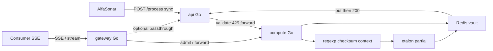

# Plan — реализация PII-модуля

Источник истины для кода. Уже: [`main.md`](main.md) (контракт),
[`balancer.md`](balancer.md) (практики), [`hack.md`](hack.md) (детали дня).
Харнес: [`AGENTS.md`](AGENTS.md), ownership: [`docs/agents/OWNERSHIP.md`](docs/agents/OWNERSHIP.md).

**Стек (зафиксировано):** весь runtime на **Go**. Rust `compute/` снимается /
переписывается. Три бинаря: sync-door (`api`), engine (`compute`), SSE-door
(`gateway`) — по тому же принципу, что Go-шлюз SSE в aida-coefficent.

---

## 0. Цель и инварианты

Сервис чекера: `POST /process` `{payload, payload_id} → {result}`.
Первый запрос с id — маскирование; второй с нашей маской — демаскирование.

| Инвариант | Правило |
|---|---|
| **Etalon forward** | Маска близка к эталону (норм. span-Levenshtein). Стиль: `И. И. И.`, `45** ****56`, PCI BIN+last4 |
| **Vault reverse** | Demask: exact `payload == stored.mask` → `original`. Не инвертировать `*` |
| **Pair** | `mask_ok == demask_ok` на прогоне |
| **Sync put** | Redis/write-through **до** HTTP 200 на новой маске |
| **No 429 on demask** | Lookup/retry **без** семафора детекции |
| **No PII in telemetry** | Логи/метрики: types, offsets, lengths, `payload_id`, timings |
| **Contract frozen** | Тела `ProcessRequest` / `ProcessResponse` не менять |
| **Zip gate** | Только исходники; `gofmt` + `go vet` (+ golangci-lint по желанию) |
| **Go-only runtime** | `api`, `compute`, `gateway` — Go. Без Rust на hot path |

---

## 1. Три слоя (два для чекера + SSE отдельно)

| Сервис | Порт (compose) | Роль | На пути AlfaSonar? |
|---|---|---|---|
| **`api/`** | `:8080` | Sync door: validate, rate limit, forward → compute | **Да** — публичный `/process` |
| **`compute/`** | internal `:8081` | Engine: detect, mask, vault, `/stats`, `/systems` | Да, за api |
| **`gateway/`** | `:8082` (опц.) | SSE / long-lived door: стримы, hold connections, notify bus | **Нет** для жюри; плюс для демо «как в проде» |

Чекер бьёт только **`api:8080`**. `gateway` не участвует в zip/load жюри, пока
не понадобится стриминг; держим в репо как отдельный бинарь с тем же контрактом
форварда в compute (или passthrough в api), чтобы не смешивать SSE-горутины с
sync `/process`.

```
api/                     # Go sync door (жюри)
  main.go
  internal/{config,handler,middleware,forwarder,ratelimit,models}/
compute/                 # Go engine (перепись с Rust)
  cmd/compute/main.go
  internal/{detect,mask,store,pipeline,handler,admin,stats,ratelimit,config}/
  dicts/
gateway/                 # Go SSE door (отдельный процесс)
  main.go
  internal/{hub,admit,proxy,config}/
docker-compose.yml       # redis + api + compute [+ gateway]
demo/{selfcheck,load}.py
scripts/pack.sh
README.md
```



**Почему SSE отдельно (как aida gateway):**
- Sync `/process` — короткие запросы, token bucket, жёсткий p99.
- SSE держит соединения минутами; один процесс с тысячами hang-горутин и sync
  detect на одном listener усложняет лимиты и таймауты.
- Gateway: hub + одна шина уведомлений (Redis), без тел ПД в bus; compute
  остаётся CPU-bound и stateless кроме vault.

---

## 2. Must-порядок

| Шаг | Что | Done when |
|---|---|---|
| M0 | Решение Go-only: каркас `compute/` на Go; Rust не на hot path | `go build ./...` в api+compute |
| M1 | Контракт `/process` + health на api и compute | curl 200; 422 на пустое тело |
| M2 | Типы ПД из ТЗ + регистр + «серия/номер» + checksums | unit tests green |
| M3 | Etalon-style partial masks | selfcheck Levenshtein ≤ порога |
| M4 | Vault + roundtrip 100%; put до 200 | demask == original; pair counters |
| M5 | FP: Пушкин / отделение; дата только с маркером; PIN iff card | context tests |
| M6 | Latency mean/p50/p95/p99 на разгоне 330→1000; limiter ~1500 | load report; 429≈0 на пике |
| M7 | Логи без ПД; README; zip + gofmt/vet | pack.sh dry-run |
| M8 | `gateway/` скелет SSE (не на критическом пути жюри) | `go test ./gateway/...`; health 200 |

**Plus (после must):** FPE FF1, synthetic, RPS 2000, другие УЛ, полный SSE-сценарий
mask→LLM→demask через gateway, admin UX.

---

## 3. Треки и exclusive globs

Параллель = **git worktree на агента**. Shared (`compose`, DTO, `feature_list.json`) — только glue.

| Track | Owner | Write | Never |
|---|---|---|---|
| A | go-api | `api/**` | `compute/**`, `gateway/**` |
| B | go-detect | `compute/internal/detect/**`, related `*_test.go` | `api/**`, `mask/**`, `store/**` |
| C | go-mask | `compute/internal/mask/**`, `dicts/**` | `api/**`, `detect/**` |
| D | go-store | `compute/internal/store/**`, keys, encrypt | `api/**`, `detect/**` |
| E | go-gateway | `gateway/**` | `api/**` handlers, `detect/**` (только клиент к compute) |
| F | glue | compose, pipeline wiring, `/stats`, zip, README, selfcheck/load, DTO sync | starts after A–D; gateway можно параллельно с E |

Подробности — обновить [`docs/agents/OWNERSHIP.md`](docs/agents/OWNERSHIP.md) под Go-пути.

---

## 4. Go api — sync door (track A)

1. `POST /process`: decode → validate non-empty → rate limit → forward.
2. Token bucket default **1500**; `429` + `Retry-After: 1`.
3. Transport: clone `DefaultTransport`, `MaxIdleConnsPerHost=32`, forward timeout ~9s.
4. Map errors: connect → 502, timeout → 504, compute 429 → passthrough.
5. `GET /app/health` → 200.
6. Logs: method, path, status, duration, `payload_id` — **не** payload.
7. Tests: 200/422/429/502/504; no payload in logs.

Стек: Go 1.22+, chi v5 (middleware), stdlib. **Без Redis** в api. **Без SSE** в api.

---

## 5. Go compute — engine (tracks B/C/D + glue)

Перепись логики с текущего Rust-каркаса на Go. Один модуль = один пакет.

### 5.1 Detect (track B)

- Structural: passport, driver license, INN (+checksum), phone, email, card+Luhn, CVV, PIN, postal, department code, birth/issue date **with marker**.
- NER/dict: FIO, address components, birth place, issuing org, citizenship, cardholder.
- Context: window + markers; `famous.txt` / `org_addresses.txt`.
- Merge: prefer structural; PIN without card → drop.
- Engine: `regexp` / `regexp/syntax` case-insensitive; compile at startup;
  NER chunks (~4k/200) через worker pool (`errgroup` / bounded goroutines).
- Не тянуть RE2-C / Hyperscan на день 1 — stdlib `regexp` (RE2-класс) достаточно
  для ~20 паттернов при avg 330 / пик 1000.

### 5.2 Mask (track C)

- Per-type **partial** в стиле эталона (таблица в `hack.md` §4.2).
- Apply spans right-to-left.
- Modes `fpe`/`synthetic`/`redact` — stubs until must green.

### 5.3 Store + process (track D + glue)

- `lookup(payload_id, payload)`: original→mask | mask→original | None.
- Hit → return immediately (**no** detect semaphore).
- Miss → acquire semaphore → pipeline → **sync** `put` (AES-GCM) → 200.
- Redis put fail → **500**, not 200.
- TTL default **86400**.
- Client: `go-redis` или `rueidis` (как в aida gateway).
- Stats: mean/p50/p95/p99, RPS, TPS est, `mask_ok`, `demask_ok`, `count_429`.

### 5.4 Admin (glue, off checker path)

`POST/GET /systems`, `GET /stats`, `GET /health`, `POST /clear`.
`/process` uses default-policy (`types=all`, `partial`, demask on).

### 5.5 Миграция с Rust

1. Не расширять Rust-логику; новые фичи — сразу в Go `compute/`.
2. Пока Go compute не зелёный: можно временно держать Rust как reference,
   но в compose для сдачи — только Go.
3. Zip **не** включает `target/`, `.rs` на hot path после cutover.

---

## 6. Go gateway — SSE door (track E)

Отдельный процесс (паттерн aida `gateway/`):

| Задача | Как |
|---|---|
| Держать SSE / long-poll | Горутины + hub; не блокировать `api` |
| Допуск / маска до LLM | HTTP к `compute` `/process` или внутренний admit |
| Уведомления | Redis notify stream (короткий id, **без** тел ПД) |
| Что не делает | Detect/mask сам; rate limit жюри-пути (это у `api`) |

Минимум на must (M8): `GET /health`, proxy/forward skeleton, один SSE echo или
stub «подписка по request_id». Полный сценарий consumer→mask→LLM→demask —
plus после зелёного `/process`.

Env: `GATEWAY_COMPUTE_URL` / `GATEWAY_API_URL`, `REDIS_URL`, `GATEWAY_APP_PORT`.

---

## 7. Selfcheck и нагрузка

### `demo/selfcheck.py`

Gate:

1. Покрытие типов ТЗ (маска закрывает ПД).
2. Forward: расстояние до эталонных строк (стиль ТЗ / Приложение B).
3. Reverse: demask(наш result) == original; `mask_ok == demask_ok`.
4. FP: Пушкин, адрес отделения — не маскируются.
5. Голая дата — нет; «дата рождения …» — да.
6. Регистр: `ПАСПОРТ 4509 123456` находится.

Формат контракта: `https://process-test.holydev.space/process` (только формат обмена).

### `demo/load.py`

Профиль `jury`: разгон 50 → ~330 → пики 1000 → **только `api:8080`**.
На каждый id: mask, затем demask **нашей** маской.
Отчёт: RPS, mean/p50/p95/p99, 429, mask_ok, demask_ok, roundtrip fails.

Отдельный профиль `sse` (опц.): нагрузка на `gateway` — не gate сдачи.

### `scripts/pack.sh`

Zip исходников без `target/`, `.git`, `venv`, бинарников, датасетов.
После cutover — без обязательного Rust tree.

---

## 8. Env (минимум)

| Var | Default | Где |
|---|---|---|
| `PII_COMPUTE_URL` | — | api |
| `PII_RPS_TARGET` | 1500 | api |
| `PII_FORWARD_TIMEOUT_SEC` | 9 | api |
| `REDIS_URL` | `redis://localhost:6379/0` | compute, gateway |
| `PII_CORR_TTL_SEC` | 86400 | compute |
| `PII_MAX_CONCURRENT` | `runtime.NumCPU()` | compute |
| `PII_SEM_WAIT_SEC` | 0.3 | compute |
| `PII_STORE_KEY` | — | compute (AES-GCM) |
| `GATEWAY_APP_PORT` | 8082 | gateway |
| `GATEWAY_COMPUTE_URL` | `http://compute:8081` | gateway |

---

## 9. Критерии сдачи

- [ ] Весь hot path на **Go** (`api` + `compute`); Rust не в compose сдачи.
- [ ] `POST /process` по контракту; идемпотентен.
- [ ] Forward: маски в стиле эталона; selfcheck Levenshtein ок.
- [ ] Reverse: 100% original; `mask_ok == demask_ok`.
- [ ] Типы ТЗ + регистр + вариации написания.
- [ ] FP + даты с маркером + PIN-гейт.
- [ ] Latency mean/p50/p95/p99 на разгоне; 429≈0 на пике 1000.
- [ ] Demask не 429; put до 200.
- [ ] ПД не в логах; store encrypted.
- [ ] Zip + gofmt/vet; README.
- [ ] `docker compose up --build` поднимает redis + api + compute.
- [ ] `gateway/` собирается и отвечает health (SSE — plus / демо).

Статус фич — [`feature_list.json`](feature_list.json). Прогресс — [`agent-progress.md`](agent-progress.md).

**Следом синхронизировать:** `AGENTS.md` (split Go/Go/Go), `OWNERSHIP.md`,
`feature_list.json`, `balancer.md` §стек, `README.md` карта — убрать «Rust compute»
как целевой runtime.
