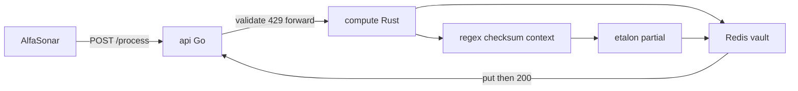

# Plan — реализация PII-модуля

Источник истины для кода. Уже: [`main.md`](main.md) (контракт),
[`balancer.md`](balancer.md) (практики), [`hack.md`](hack.md) (детали дня).
Харнес: [`AGENTS.md`](AGENTS.md), ownership: [`docs/agents/OWNERSHIP.md`](docs/agents/OWNERSHIP.md).

---

## 0. Цель и инварианты

Сервис: `POST /process` `{payload, payload_id} → {result}`.
Первый запрос с id — маскирование; второй с нашей маской — демаскирование.

| Инвариант | Правило |
|---|---|
| **Etalon forward** | Маска близка к эталону (норм. span-Levenshtein). Стиль: `И. И. И.`, `45** ****56`, PCI BIN+last4 |
| **Vault reverse** | Demask: exact `payload == stored.mask` → `original`. Не инвертировать `*` |
| **Pair** | `mask_ok == demask_ok` на прогоне |
| **Sync put** | Redis/write-through **до** HTTP 200 на новой маске |
| **No 429 on demask** | Lookup/retry **без** семафора детекции |
| **No PII in telemetry** | Логи/метрики: types, offsets, lengths, `payload_id`, timings |
| **Contract frozen** | Тела `ProcessRequest` / `ProcessResponse` не менять |
| **Zip gate** | Только исходники; clippy/vet чистые |

---

## 1. Архитектура файлов

```
api/                     # создать — Go door
  main.go
  internal/{config,handler,middleware,forwarder,ratelimit,models}/
compute/                 # уже есть — Rust engine
  src/{detect,mask,store,pipeline,routers,stats,...}
docker-compose.yml       # redis + api + compute
demo/{selfcheck,load}.py
scripts/pack.sh
README.md                # ≤5 предложений
```



---

## 2. Must-порядок

| Шаг | Что | Done when |
|---|---|---|
| M1 | Контракт `/process` + health на api и compute | curl 200; 422 на пустое тело |
| M2 | Типы ПД из ТЗ + регистр + «серия/номер» + checksums | unit tests green |
| M3 | Etalon-style partial masks | selfcheck Levenshtein ≤ порога на фикстурах |
| M4 | Vault + roundtrip 100%; put до 200 | demask == original; pair counters |
| M5 | FP: Пушкин / отделение; дата только с маркером; PIN iff card | context tests |
| M6 | Latency mean/p50/p95/p99 на разгоне 330→1000; limiter ~1500 | load report; 429≈0 на пике |
| M7 | Логи без ПД; README ≤5; zip + clippy/vet | pack.sh dry-run; `clippy -D warnings` |

**Plus (после must):** FPE FF1, synthetic, RPS 2000, другие УЛ, admin UX.

---

## 3. Треки и exclusive globs

Параллель = **git worktree на агента**. Shared (`compose`, DTO, `feature_list.json`) — только glue.

| Track | Owner | Write | Never |
|---|---|---|---|
| A | go-api | `api/**` | `compute/**` |
| B | rust-detect | `compute/src/detect/**`, related tests | `api/**`, `mask/**`, `store.rs` |
| C | rust-mask | `compute/src/mask/**`, `dicts/**` | `api/**`, `detect/**` |
| D | rust-store | `store.rs`, `keys.rs`, redis encrypt glue | `api/**`, `detect/**` |
| E | glue | compose, pipeline wiring, `/stats`, zip, README, selfcheck/load | starts after A–D |

Подробности: [`docs/agents/OWNERSHIP.md`](docs/agents/OWNERSHIP.md).

---

## 4. Go api (track A)

1. `POST /process`: decode → validate non-empty → rate limit → forward.
2. Token bucket default **1500**; `429` + `Retry-After: 1`.
3. Transport: clone DefaultTransport, `MaxIdleConnsPerHost=32`, forward timeout ~9s.
4. Map errors: connect → 502, timeout → 504, compute 429 → passthrough.
5. `GET /app/health` → 200.
6. Logs: method, path, status, duration, `payload_id` — **не** payload.
7. Tests: 200/422/429/502/504; no payload in logs.

Стек: Go 1.22+, chi v5, stdlib. Без Redis в api.

---

## 5. Rust compute

### 5.1 Detect (track B)

- Structural: passport, driver license, INN (+checksum), phone, email, card+Luhn, CVV, PIN, postal, department code, birth/issue date **with marker**.
- NER/dict: FIO, address components, birth place, issuing org, citizenship, cardholder.
- Context: window + markers; famous.txt / org_addresses.txt.
- Merge: prefer regex; PIN without card → drop.
- Engine: `regex` case-insensitive; compile at startup; chunks for NER (~4k/200).

### 5.2 Mask (track C)

- Per-type **partial** in etalon style (таблица в `hack.md` §4.2).
- Apply spans right-to-left.
- Modes `fpe`/`synthetic`/`redact` — stubs only until must green.

### 5.3 Store + process (track D + glue)

- `lookup(payload_id, payload)`: original→mask | mask→original | None.
- Hit → return immediately (**no** detect semaphore).
- Miss → acquire semaphore → pipeline → **sync** `put` (AES-GCM) → 200.
- Redis put fail → **500**, not 200.
- TTL default **86400**.
- Stats: mean/p50/p95/p99, RPS, TPS est, `mask_ok`, `demask_ok`, `count_429`.

### 5.4 Admin (glue, off checker path)

`POST/GET /systems`, `GET /stats`, `GET /health`, `POST /clear`.
`/process` uses default-policy (`types=all`, `partial`, demask on).

---

## 6. Selfcheck и нагрузка

### `demo/selfcheck.py`

Gate:

1. Покрытие типов ТЗ (маска закрывает ПД).
2. Forward: расстояние до эталонных строк (стиль ТЗ / Приложение B).
3. Reverse: demask(наш result) == original; `mask_ok == demask_ok`.
4. FP: Пушкин, адрес отделения — не маскируются.
5. Голая дата — нет; «дата рождения …» — да.
6. Регистр: `ПАСПОРТ 4509 123456` находится.

Формат контракта: `https://process-test.holydev.space/process` (только формат обмена).

### `demo/load.py`

Профиль `jury`: разгон 50 → ~330 → пики 1000.
На каждый id: mask, затем demask **нашей** маской.
Отчёт: RPS, mean/p50/p95/p99, 429, mask_ok, demask_ok, roundtrip fails.

### `scripts/pack.sh`

Zip исходников без `target/`, `.git`, `venv`, бинарников, датасетов.

---

## 7. Env (минимум)

| Var | Default | Где |
|---|---|---|
| `PII_COMPUTE_URL` | — | api |
| `PII_RPS_TARGET` | 1500 | api |
| `PII_FORWARD_TIMEOUT_SEC` | 9 | api |
| `REDIS_URL` | `redis://localhost:6379/0` | compute |
| `PII_CORR_TTL_SEC` | 86400 | compute |
| `PII_MAX_CONCURRENT` | num_cpus | compute |
| `PII_SEM_WAIT_SEC` | 0.3 | compute |
| `PII_STORE_KEY` | — | compute (AES-GCM) |

---

## 8. Критерии сдачи

- [ ] `POST /process` по контракту; идемпотентен.
- [ ] Forward: маски в стиле эталона; selfcheck Levenshtein ок.
- [ ] Reverse: 100% original; `mask_ok == demask_ok`.
- [ ] Типы ТЗ + регистр + вариации написания.
- [ ] FP + даты с маркером + PIN-гейт.
- [ ] Latency mean/p50/p95/p99 на разгоне; 429≈0 на пике 1000.
- [ ] Demask не 429; put до 200.
- [ ] ПД не в логах; store encrypted.
- [ ] Zip + clippy/vet; README ≤5 предложений.
- [ ] `docker compose up --build` поднимает redis+api+compute.

Статус фич — [`feature_list.json`](feature_list.json). Прогресс — [`agent-progress.md`](agent-progress.md).
